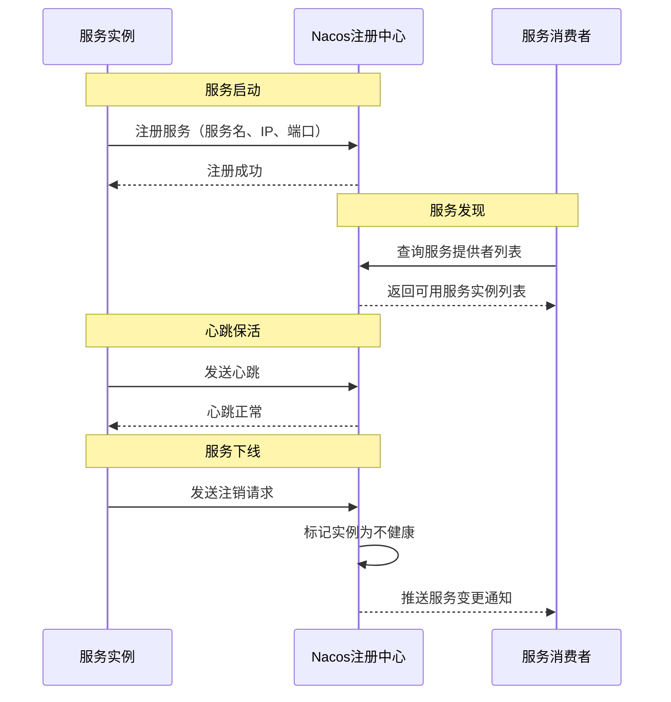
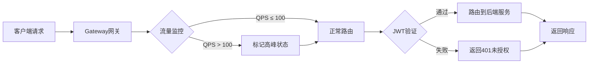
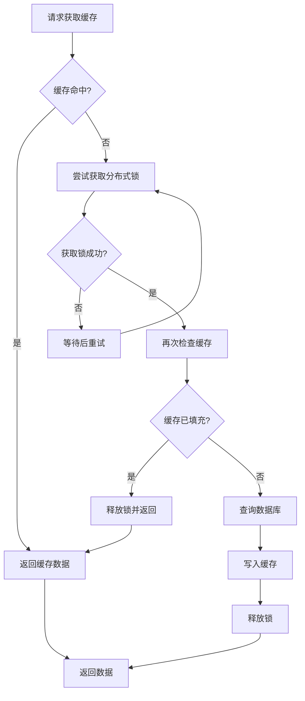
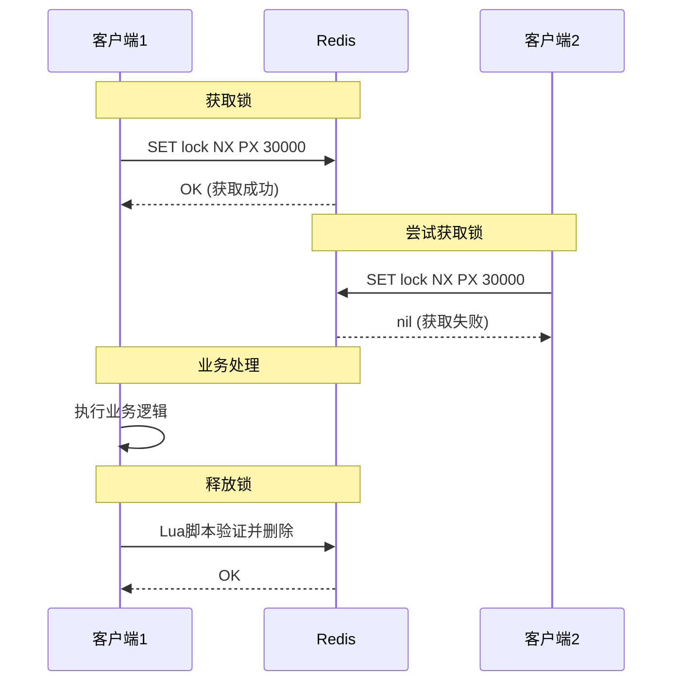
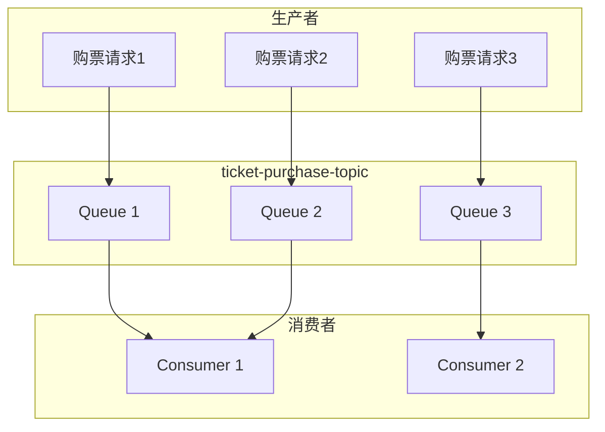
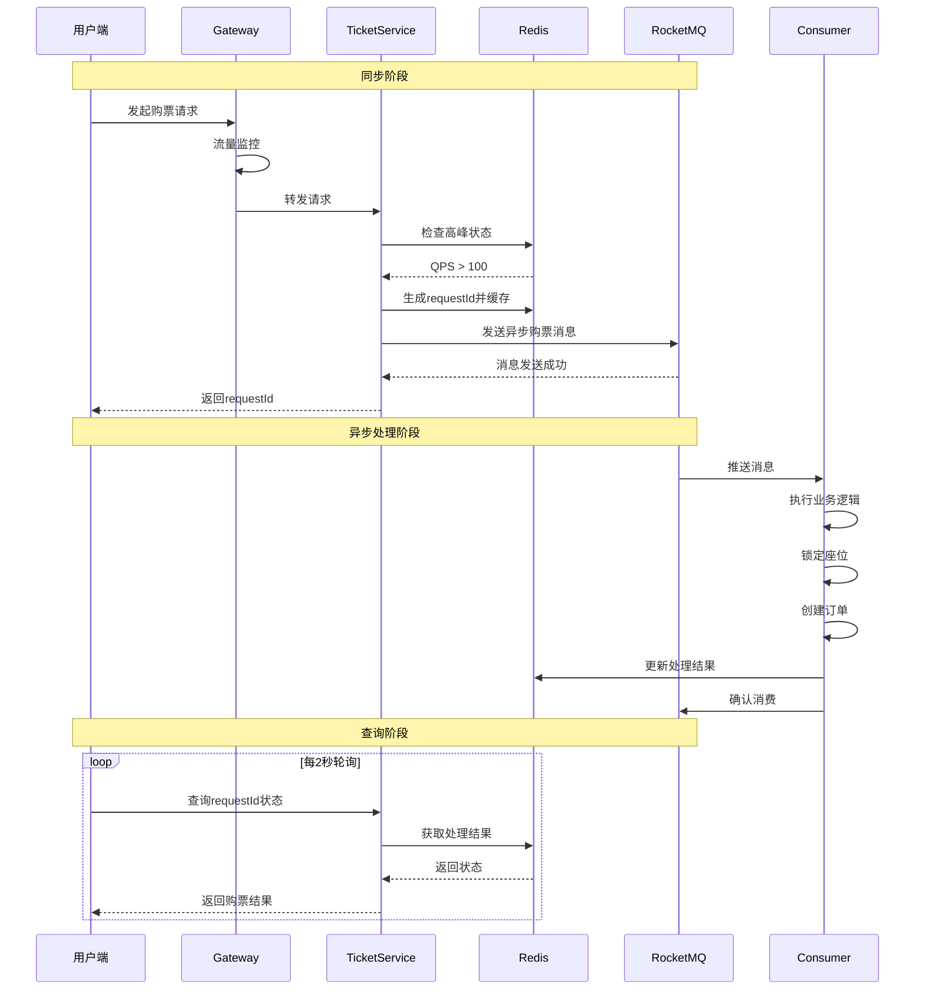
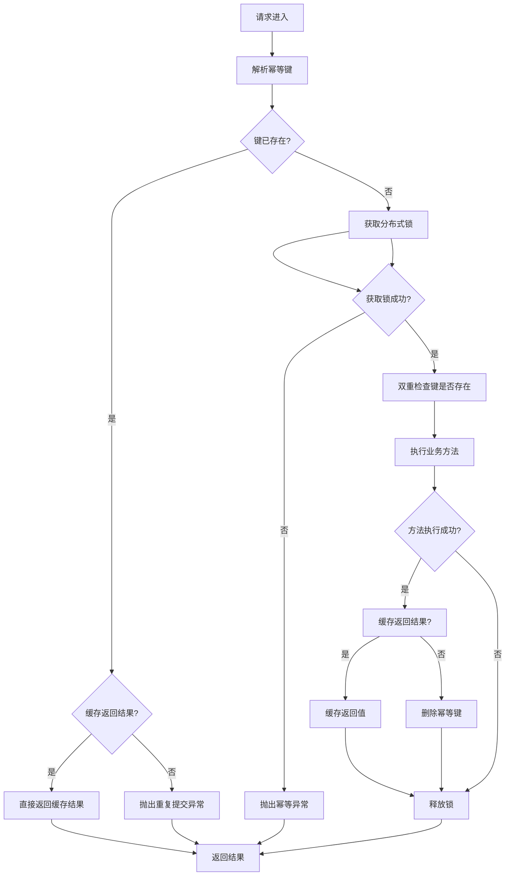
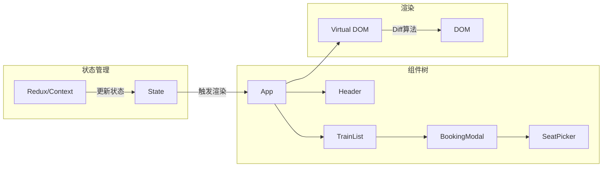
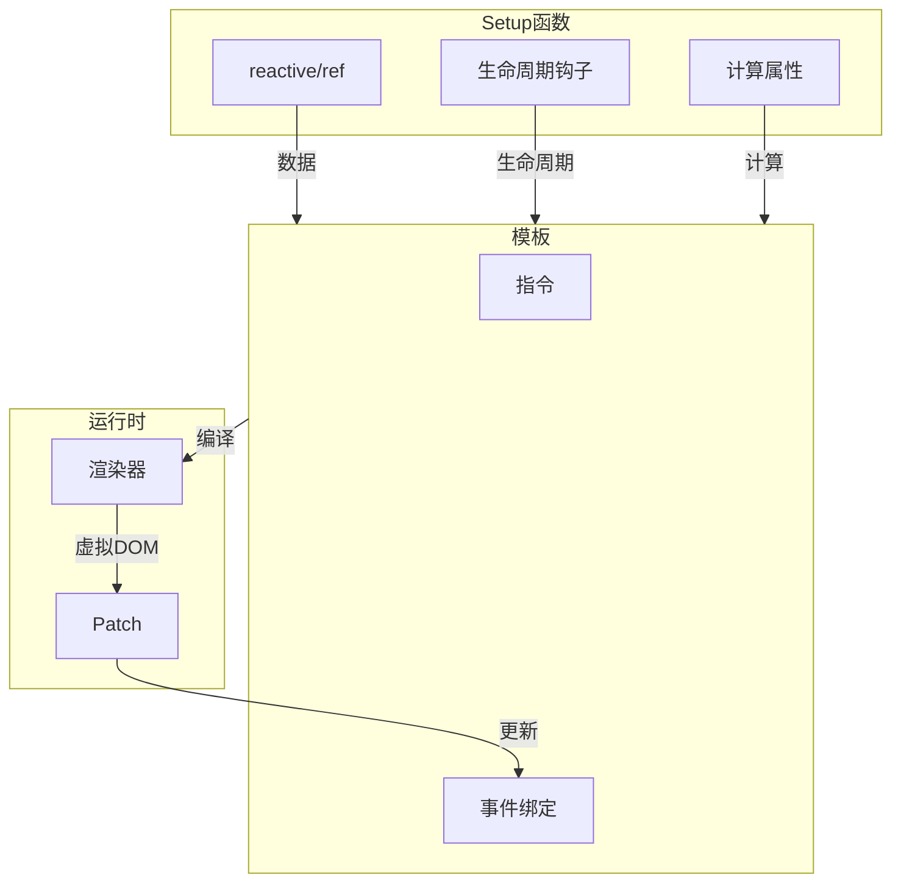

# 第2章 关键技术原理

## 2.1 Spring Cloud微服务架构

### 2.1.1 微服务架构概述

微服务架构（Microservices Architecture）是一种将单一应用程序划分为一组小服务的架构风格，每个服务运行在独立进程中，服务之间通过轻量级通信机制（如HTTP RESTful API）进行交互[^1]。与传统的单体架构相比，微服务架构具有以下优势：

1. **独立部署**：每个微服务可以独立编译、测试和部署，不影响其他服务；
2. **技术多样性**：不同服务可根据业务特点选择最适合的技术栈；
3. **故障隔离**：单个服务的故障不会导致整个系统瘫痪；
4. **可扩展性**：可针对瓶颈服务进行针对性扩容。

Spring Cloud是基于Spring Boot的微服务架构开发工具集，它提供了一整套微服务解决方案，包括服务注册与发现、配置管理、服务网关、负载均衡、断路器等组件[^2]。

### 2.1.2 服务注册与发现

在微服务架构中，服务实例的网络位置是动态变化的，为了实现服务间的正常通信，需要引入服务注册与发现机制。本系统采用Nacos作为服务注册中心，其工作原理如图2-1所示。



**图2-1 Nacos服务注册与发现流程**

服务启动时，服务实例向Nacos注册中心发送注册请求，包含服务名、IP地址、端口号等信息。服务消费者通过服务名查询注册中心获取可用服务实例列表，并从中选择一个进行调用。同时，服务实例定期向注册中心发送心跳，以证明自身处于存活状态。如果服务实例未能按时发送心跳，Nacos会将其从服务列表中移除，并通知所有订阅该服务变化的消费者。

### 2.1.3 服务网关

API网关是微服务架构的统一入口，所有客户端请求都通过网关进行路由转发。本系统采用Spring Cloud Gateway作为API网关，其核心功能包括：

1. **路由转发**：根据请求路径将请求转发到对应的后端服务；
2. **身份认证**：验证JWT令牌，过滤非法请求；
3. **流量监控**：统计QPS，识别流量高峰；
4. **限流熔断**：防止系统过载，保护后端服务。



**图2-2 API网关请求处理流程**

### 2.1.4 服务间通信

微服务之间采用OpenFeign进行声明式HTTP调用。OpenFeign通过接口定义和注解配置，自动完成服务发现、负载均衡和HTTP请求构建，大大简化了服务间调用的开发工作[^3]。

```java
@FeignClient(name = "seat-service")
public interface SeatServiceClient {

    @PostMapping("/seat/lock")
    Result<LockSeatVO> lockSeat(@RequestBody LockSeatRequest request);

    @GetMapping("/seat/carriage/{trainNumber}/{date}")
    Result<CarriageVO> getCarriages(
        @PathVariable("trainNumber") String trainNumber,
        @PathVariable("date") String date
    );
}
```

上述代码定义了一个Feign客户端接口，`@FeignClient`注解指定了目标服务名，Spring Cloud会自动从Nacos获取该服务的可用实例，并完成负载均衡调用。

---

## 2.2 Redis缓存技术

### 2.2.1 Redis概述

Redis是一个开源的、基于内存的数据结构存储系统，常用作数据库、缓存和消息队列[^4]。Redis支持丰富的数据结构，包括字符串（String）、哈希（Hash）、列表（List）、集合（Set）、有序集合（Sorted Set）等，能够满足各种业务场景的需求。

在票务系统中，Redis主要承担以下职责：
1. **数据缓存**：缓存车次信息、座位状态等热点数据；
2. **分布式锁**：保证并发场景下的资源互斥访问；
3. **会话存储**：存储用户登录状态和Token信息；
4. **消息队列**：使用Redis Stream实现轻量级消息队列。

### 2.2.2 缓存击穿与解决方案

缓存击穿（Cache Breakdown）是指缓存中没有但数据库中有的数据，当大量并发请求同时访问这个热点数据时，这些请求都会直接打到数据库上，导致数据库压力骤增。

本系统采用Redisson实现分布式锁来解决缓存击穿问题，其核心实现逻辑如图2-3所示。



**图2-3 缓存击穿解决方案流程图**

本系统的`SafeCacheTemplate`封装了上述逻辑，提供了`safeGet`方法：

```java
public <T> T safeGet(String key, Supplier<T> loader, TypeReference<T> typeReference,
                     long cacheTtl, TimeUnit timeUnit) {
    // 1. 先读缓存（无锁，高性能）
    T cached = get(key, typeReference);
    if (cached != null) {
        return cached;
    }

    // 2. 缓存未命中，加分布式锁
    String lockKey = "lock:" + key;
    RLock lock = redissonClient.getLock(lockKey);

    try {
        boolean locked = lock.tryLock(2, 10, TimeUnit.SECONDS);
        // ... 双重检查后加载数据
    } finally {
        if (lock.isHeldByCurrentThread()) {
            lock.unlock();
        }
    }
}
```

### 2.2.3 分布式锁实现

Redisson是基于Redis的Java客户端，提供了完善的分布式锁实现。其核心原理是使用Redis的SET命令配合NX（只在键不存在时设置）和PX（设置过期时间毫秒）选项：

```redis
SET lock_key unique_value NX PX 30000
```

这条命令保证只有第一个获取锁的客户端能成功设置键，其他客户端会立即返回失败。锁的持有者需要在处理完业务后显式释放锁，释放时需要验证当前持有者是否为自己（通过Lua脚本保证原子性）。



**图2-4 Redisson分布式锁工作原理**

---

## 2.3 RocketMQ消息队列

### 2.3.1 消息队列概述

消息队列（Message Queue）是一种进程间通信机制，用于解决异步处理、服务解耦和流量削峰等问题[^5]。在高并发系统中，消息队列的作用尤为重要：

1. **异步处理**：将非核心流程从主流程中剥离，提升系统响应速度；
2. **服务解耦**：生产者和消费者之间不直接依赖，降低系统耦合度；
3. **流量削峰**：将突发流量平滑到后续时间处理，保护后端系统。

RocketMQ是阿里巴巴开源的分布式消息中间件，具有高可用、高可靠、高性能等特点，广泛应用于电商、金融、物流等领域[^6]。

### 2.3.2 消息队列模型

RocketMQ的消息模型包含以下核心概念：



**图2-5 RocketMQ消息模型**

- **Topic（主题）**：消息的分类管理单位，本系统中`ticket-purchase-topic`用于管理购票相关消息；
- **Tag（标签）**：用于对Topic中的消息进行细分，如`purchase`表示购票消息、`cancel`表示取消消息；
- **Queue（队列）**：消息存储和分发的实际载体，一个Topic可有多个Queue实现负载均衡；
- **Consumer Group（消费者组）**：一组消费者的集合，同一Consumer Group内的消费者负载消费消息。

### 2.3.3 异步购票流程

本系统使用RocketMQ实现异步购票功能，其核心流程如图2-6所示。



**图2-6 异步购票流程时序图**

### 2.3.4 消息消费保障

RocketMQ提供了多种机制保证消息的可靠消费：

1. **消息持久化**：消息先写入磁盘再响应生产者，确保消息不丢失；
2. **消费确认**：消费者处理完成后发送ACK，如果消费失败，消息会被重新投递；
3. **重试机制**：消费失败的消息会自动进入重试队列，默认重试16次，每次间隔时间递增。

本系统的消费者实现：

```java
@MessageConsumer(
    topic = "ticket-purchase-topic",
    tag = "purchase",
    consumerGroup = "ticket-purchase-consumer",
    consumeMode = ConsumeMode.CONCURRENTLY
)
public class TicketPurchaseConsumer extends RocketMQBaseConsumer<AsyncTicketPurchaseMessage> {

    @Override
    protected void doProcess(AsyncTicketPurchaseMessage message) {
        // 处理购票逻辑
        // 如果抛出异常，RocketMQ会自动重试
    }
}
```

---

## 2.4 分布式锁与幂等性设计

### 2.4.1 幂等性概念

幂等性（Idempotency）是指一个操作被执行一次和被执行多次的结果是一致的。在分布式系统中，由于网络波动、重试机制等原因，同一个请求可能被发送多次，如果业务操作不具备幂等性，就会导致重复下单、重复扣款等问题[^7]。

### 2.4.2 幂等性注解实现

本系统通过AOP切面实现幂等性保护，提供了`@Idempotent`注解：

```java
@Idempotent(
    key = "${#request.orderSn}",
    expire = 300,
    cacheResult = true,
    message = "订单已存在，请勿重复提交"
)
public Result createOrder(CreateOrderRequest request) {
    // 创建订单逻辑
}
```

其核心实现原理如图2-7所示。



**图2-7 幂等性处理流程图**

幂等性切面的核心逻辑：

1. 解析注解中的key表达式，构建完整的幂等键；
2. 尝试从Redis获取分布式锁，确保同一时间只有一个请求能执行；
3. 双重检查：获取锁后再次检查幂等键，可能其他线程已经执行完成；
4. 执行目标方法，如果配置了缓存结果则保存返回值；
5. 释放锁并返回结果。

### 2.4.3 座位锁定与释放

座位作为不可重复销售的关键资源，其锁定操作必须保证原子性和一致性。本系统使用Redis实现分布式锁来保证座位操作的幂等性：

```java
public boolean lockSeat(String trainNum, String date, String seatNo) {
    String lockKey = "seat:lock:" + trainNum + ":" + date + ":" + seatNo;
    RLock lock = redissonClient.getLock(lockKey);

    try {
        // 尝试获取锁，等待0秒，持有锁30秒（自动续期）
        boolean locked = lock.tryLock(0, 30, TimeUnit.SECONDS);
        if (!locked) {
            return false; // 座位已被锁定
        }

        // 检查座位是否已被售出
        String seatKey = "seat:status:" + trainNum + ":" + date + ":" + seatNo;
        Boolean result = redisTemplate.opsForValue()
                .setIfAbsent(seatKey, "locked", 30, TimeUnit.MINUTES);

        return result != null && result;
    } finally {
        if (lock.isHeldByCurrentThread()) {
            lock.unlock();
        }
    }
}
```

---

## 2.5 前端框架技术

### 2.5.1 React用户端

React是Facebook开发的用于构建用户界面的JavaScript库，其核心特性包括虚拟DOM、组件化开发和单向数据流[^8]。



**图2-8 React组件渲染流程**

本系统用户端采用React 18 + TypeScript技术栈，主要特点：

1. **TypeScript类型安全**：编译时检查类型，减少运行时错误；
2. **Hooks函数式组件**：使用useState、useEffect等Hook管理组件状态；
3. **Vite构建工具**：快速的开发服务器和优化的生产构建；
4. **TailwindCSS样式**：原子化CSS，快速构建响应式界面。

### 2.5.2 Vue3管理端

Vue3是渐进式JavaScript框架，相比Vue2进行了全面升级，包括使用Proxy代替defineProperty实现响应式、Composition API、Treeshaking支持等[^9]。



**图2-9 Vue3响应式原理**

本系统管理端采用Vue3 + Arco Design技术栈：

1. **Arco Design组件库**：字节跳动出品的Vue3企业级UI组件库；
2. **Pinia状态管理**：轻量级Vue3专用状态管理库；
3. **Axios请求封装**：统一处理请求拦截、响应拦截、错误处理。

---

## 参考文献

[^1]: Newman S. Building Microservices: Designing Fine-Grained Systems[M]. 2nd Edition. O'Reilly Media, 2021.

[^2]: John Carnell. Spring Microservices in Action[M]. Manning Publications, 2017.

[^3]: OpenFeign. OpenFeign Documentation[EB/OL]. https://github.com/OpenFeign/feign, 2023.

[^4]: Redis Labs. Redis Documentation[EB/OL]. https://redis.io/docs, 2024.

[^5]: Richardson L, Ruby S. RESTful Web Services[M]. O'Reilly Media, 2007.

[^6]: Apache Software Foundation. RocketMQ Documentation[EB/OL]. https://rocketmq.apache.org/docs/, 2024.

[^7]: Fowler J. Patterns of Enterprise Application Architecture[M]. Addison-Wesley, 2002.

[^8]: Facebook. React Documentation[EB/OL]. https://react.dev, 2024.

[^9]: Evan You. Vue 3 Documentation[EB/OL]. https://vuejs.org, 2024.
