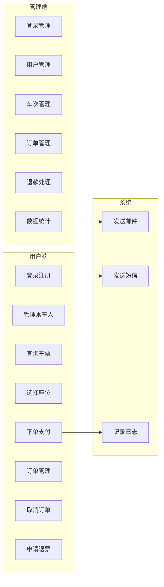
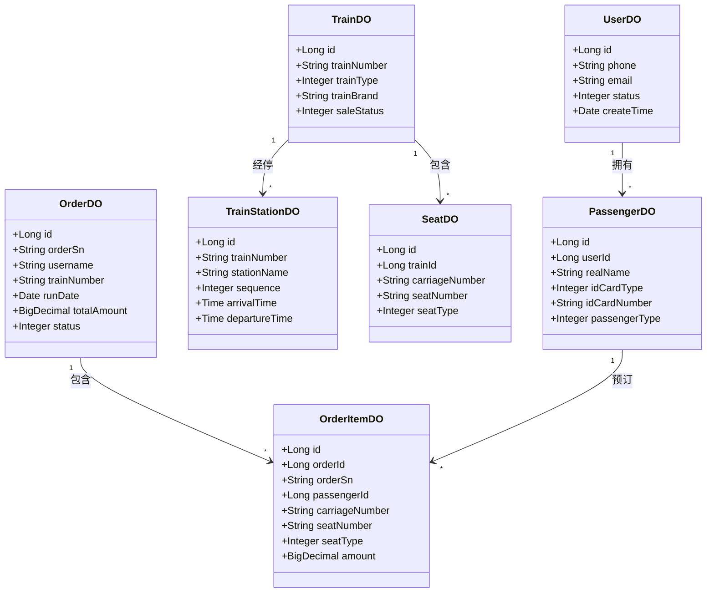
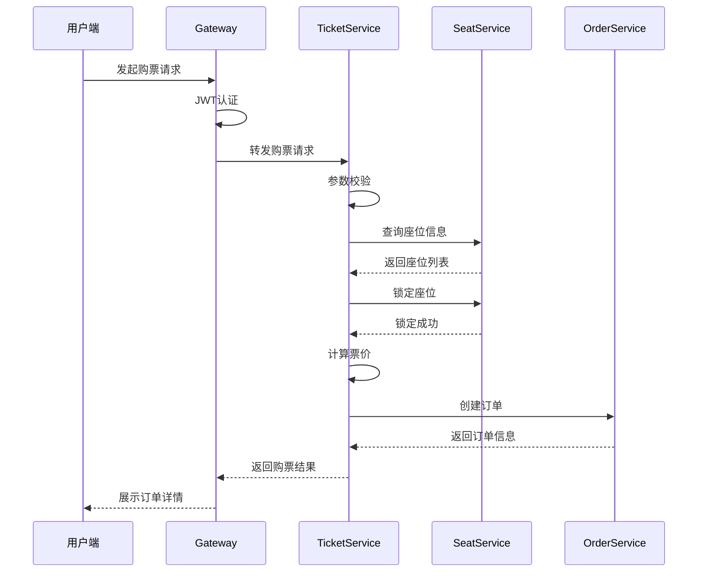
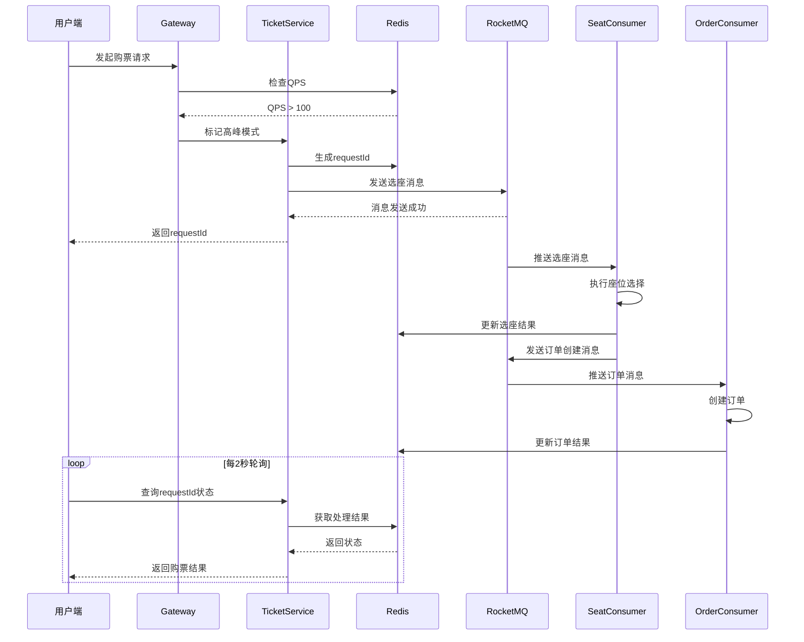
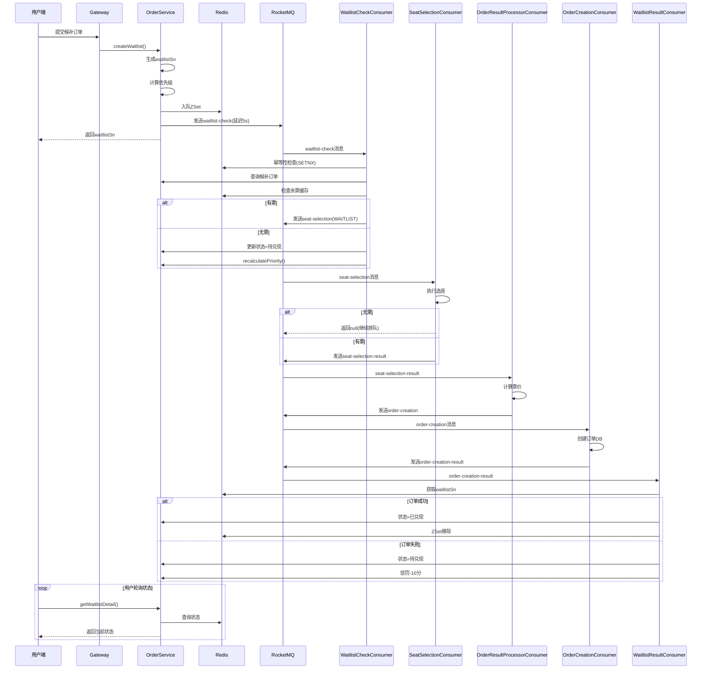
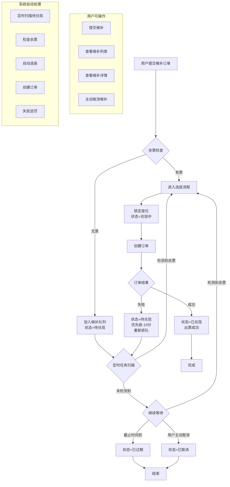
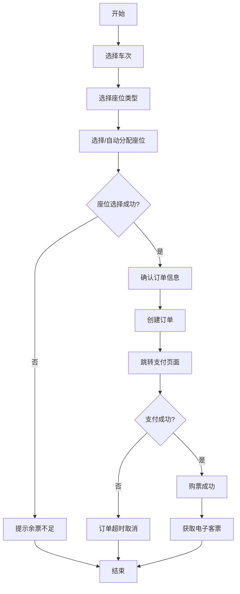
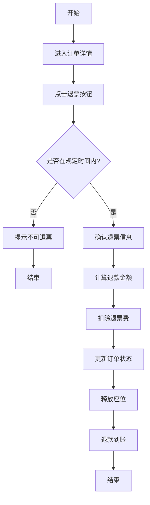

# 第3章 需求分析

## 3.1 业务需求分析

### 3.1.1 系统业务概述

铁路票务系统是面向广大旅客的火车票购买与管理系统，其核心业务包括用户管理、车票查询、座位选择、订单处理和后台管理等。本系统需要满足以下业务需求：

1. **用户注册与登录**：用户通过手机号注册账号，完成身份验证后登录系统；
2. **乘车人管理**：用户可以添加、编辑、删除常用乘车人信息；
3. **车票查询**：用户根据出发地、目的地、出发日期查询可选列车及余票信息；
4. **座位选择**：用户可以手动选择座位或由系统自动分配座位；
5. **订单处理**：包括订单创建、支付、取消、退款等全生命周期管理；
6. **后台管理**：管理员对用户、车次、订单进行管理和数据统计分析。

### 3.1.2 业务流程分析

铁路票务系统的核心业务流程包括以下几个环节：

**（1）用户登录流程**

用户登录是进入系统的第一步，系统采用手机号+短信验证码的方式进行身份认证。登录流程如下：用户输入手机号后，系统发送验证码到用户手机；用户输入正确的验证码后，系统验证并创建会话，返回用户信息和JWT Token；后续请求携带Token进行身份认证。

**（2）车票查询流程**

用户登录后，可以进行车票查询操作。用户输入出发地、目的地和出发日期后，系统返回符合条件的列车列表，包括车次、出发时间、到达时间、历时、票价、余票等信息。系统支持中转换乘查询，为没有直达车的路线提供换乘方案。

**（3）购票下单流程**

用户选择列车后，进入座位选择页面。系统展示该车次的座位图，用户可以手动选择座位或选择自动分配。确认座位后，系统计算票价并创建订单，用户需要在规定时间内完成支付。

**（4）订单管理流程**

用户可以在订单中心查看所有订单，包括待支付、已支付、已完成、已取消、已退款等状态的订单。用户可以对未支付的订单进行支付或取消操作，对已支付的订单可以申请退票。

### 3.1.3 非功能性需求

除了功能性需求外，系统还需要满足以下非功能性需求：

1. **性能需求**：系统应能够支持QPS > 100的并发访问，响应时间不超过3秒；
2. **可用性需求**：系统可用性应达到99.9%，具备故障转移能力；
3. **可扩展性需求**：系统应支持水平扩展，能够通过增加服务实例来应对流量增长；
4. **安全性需求**：用户密码和敏感信息应加密存储，通信应使用HTTPS协议；
5. **数据一致性**：订单处理必须保证数据一致性，避免超卖等问题。

---

## 3.2 系统功能分析

### 3.2.1 用例图设计

根据业务需求分析，本系统的用例图如图3-1所示。

**图3-1 系统用例图**

### 3.2.2 用户端功能模块

**（1）登录注册模块**

| 功能 | 描述 |
|------|------|
| 手机号登录 | 输入手机号，获取并验证短信验证码 |
| 退出登录 | 清除会话信息，返回登录页 |
| Token刷新 | 自动刷新即将过期的Token |

**（2）乘车人管理模块**

| 功能 | 描述 |
|------|------|
| 添加乘车人 | 录入姓名、证件类型、证件号码等信息 |
| 编辑乘车人 | 修改已有乘车人信息 |
| 删除乘车人 | 移除不再使用的乘车人 |
| 设置默认 | 指定默认乘车人，购票时自动填充 |

**（3）车票查询模块**

| 功能 | 描述 |
|------|------|
| 区间查询 | 按出发地、目的地、日期查询列车 |
| 余票查询 | 查询各座位类型的余票数量 |
| 换乘查询 | 查询中转换乘方案 |
| 车次详情 | 查看车次经停站信息 |
| 候补提示 | 无票时显示候补按钮和预计排队人数 |

**（4）座位选择模块**

| 功能 | 描述 |
|------|------|
| 座位图展示 | 可视化展示车厢座位分布 |
| 手动选座 | 用户点击选择具体座位 |
| 自动选座 | 系统自动分配相邻座位 |
| 座位锁定 | 临时锁定选中的座位 |

**（5）候补购票模块**

| 功能 | 描述 |
|------|------|
| 候补下单 | 无票时提交候补订单，设置截止时间并预付款 |
| 候补列表 | 查看用户所有候补订单及当前状态 |
| 候补详情 | 查看候补订单详细信息（车次、优先级、排队位置） |
| 候补取消 | 主动取消候补订单，释放排队位置并退款 |
| 自动兑现 | 系统定时检测余票，自动为排队用户选座并创建订单 |
| 失败重试 | 订单创建失败后自动回滚状态，降低优先级重新排队 |

**（6）订单管理模块**

| 功能 | 描述 |
|------|------|
| 创建订单 | 选择座位后创建订单 |
| 支付订单 | 完成订单支付 |
| 取消订单 | 取消未支付订单 |
| 申请退票 | 对已支付订单申请退票 |
| 订单查询 | 查看历史订单记录 |

### 3.2.3 管理端功能模块

**（1）数据统计模块**

| 功能 | 描述 |
|------|------|
| 订单统计 | 按日/周/月统计订单数量和金额 |
| 用户统计 | 统计注册用户数和活跃用户数 |
| 车票统计 | 统计各车次的上座率 |

**（2）用户管理模块**

| 功能 | 描述 |
|------|------|
| 用户列表 | 查看所有注册用户 |
| 用户禁用 | 禁用/启用用户账号 |

**（3）车次管理模块**

| 功能 | 描述 |
|------|------|
| 车次列表 | 查看所有车次信息 |
| 车次编辑 | 修改车次的基本信息 |
| 站点管理 | 管理车次的经停站点 |
| 线路管理 | 管理出发地到目的地的线路配置 |

**（4）订单管理模块**

| 功能 | 描述 |
|------|------|
| 订单列表 | 查看所有订单 |
| 订单详情 | 查看订单详细信息 |
| 退款处理 | 处理用户的退款申请 |

---

## 3.3 UML建模

### 3.3.1 类图设计

系统的核心类图如图3-2所示，主要包括实体类、服务类和控制器类。

**图3-2 核心类图**

### 3.3.2 时序图设计

**（1）同步购票时序图**

**图3-3 同步购票时序图**

**（2）异步购票时序图**

**图3-4 异步购票时序图**

**（3）候补购票时序图**

**图3-5 候补购票时序图**

### 3.3.3 活动图设计

**（1）候补活动图**

候补订单的核心活动流程如下，从用户提交候补到最终兑现或取消的全过程：

**图3-5 候补购票活动图**

**（2）购票活动图**

**图3-5 购票活动图**

**（2）退票活动图**

**图3-6 退票活动图**

---

## 3.4 非功能性需求分析

### 3.4.1 可行性分析

**技术可行性**：本系统采用主流的Spring Cloud微服务架构，结合Redis、RocketMQ等成熟的中间件，技术方案经过大量生产环境验证，具有良好的技术可行性。

**经济可行性**：Spring Cloud、Redis、RocketMQ等基础组件均为开源软件，无license费用。系统采用Docker容器化部署，可充分利用服务器资源，降低硬件成本。

**操作可行性**：系统采用B/S架构，用户通过浏览器即可访问，无需安装客户端软件。管理端采用可视化界面，操作简便。

### 3.4.2 系统约束

1. **时间约束**：项目需在规定时间内完成开发和测试；
2. **资源约束**：开发资源有限，需合理分配人力和时间；
3. **技术约束**：需使用学校或导师指定的技术栈；
4. **安全约束**：用户敏感信息需加密存储，满足相关安全规范。
