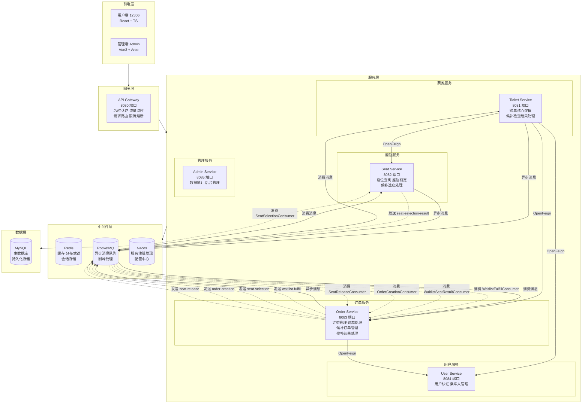
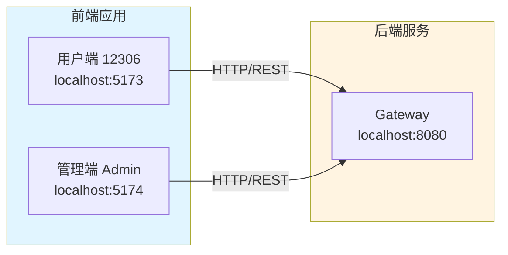
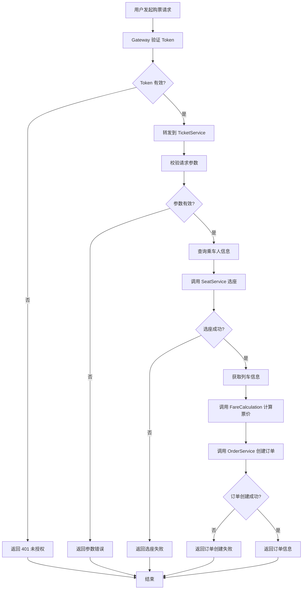
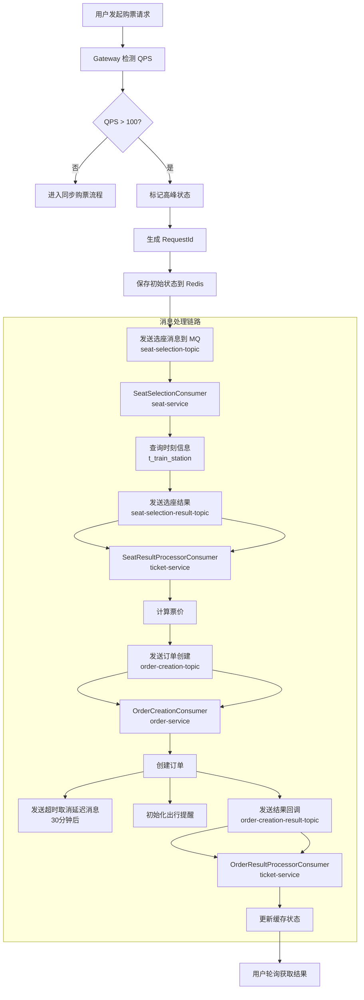
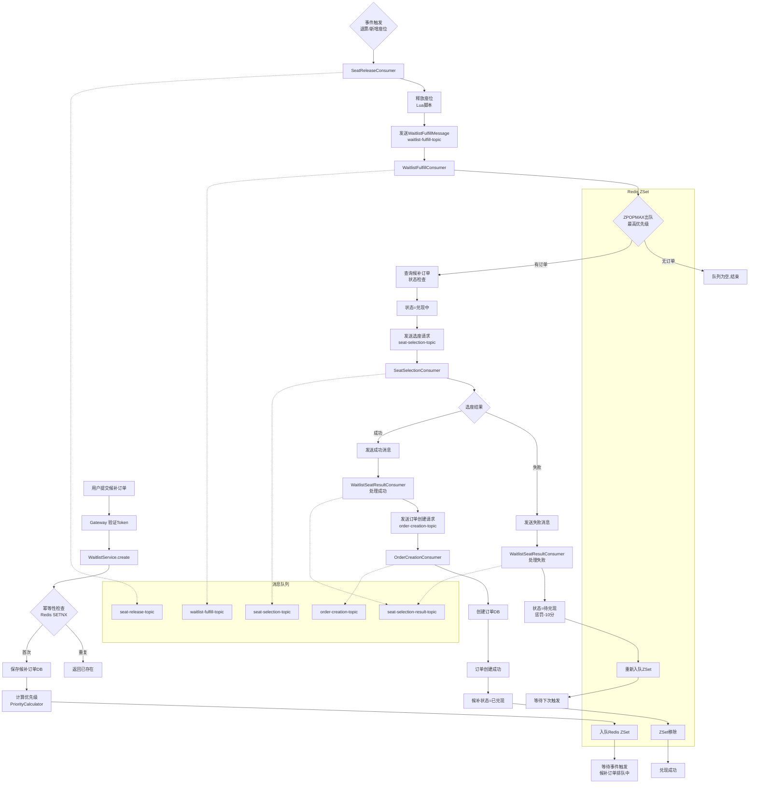
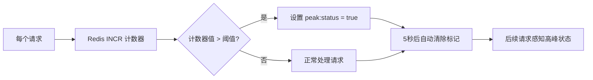
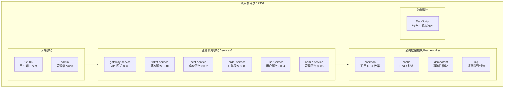
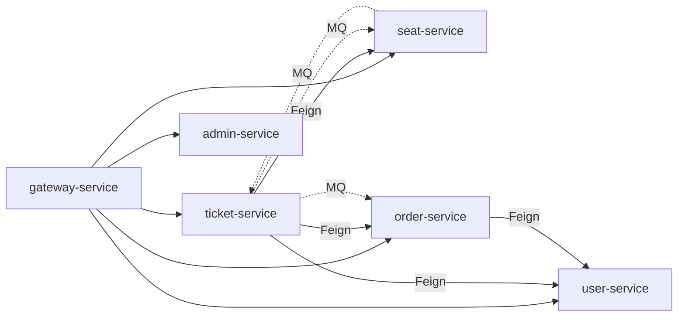
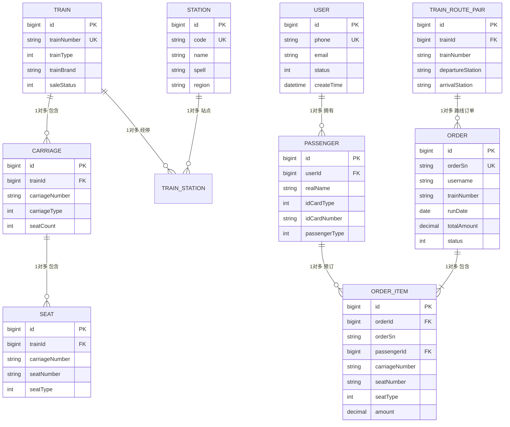
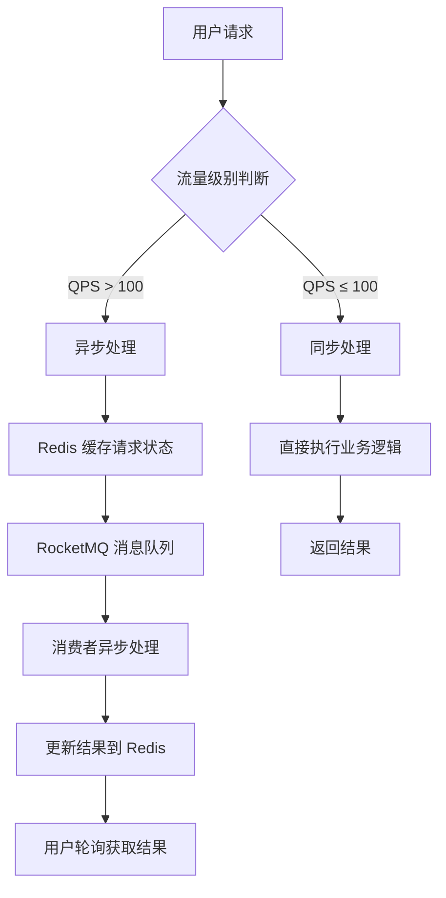

# 第4章 架构设计

## 4.1 系统架构原理

### 4.1.1 总体架构设计

本系统采用Spring Cloud微服务架构，将铁路票务系统的核心功能拆分为多个独立的微服务，各服务之间通过HTTP RESTful API和消息队列进行通信。系统的总体架构如图4-1所示。



**图4-1 系统总体架构图**

### 4.1.2 分层架构设计

系统采用经典的分层架构设计，自上而下分为四层：

**（1）接入层（Gateway）**

API网关作为系统的统一入口，负责：
- 身份认证：验证JWT Token，过滤非法请求
- 流量监控：统计QPS，识别流量高峰并标记
- 路由分发：根据请求路径将请求转发到对应的后端服务
- 限流熔断：防止系统过载，保护后端服务

**（2）业务层（Services）**

业务服务层包含五个核心微服务：
- Ticket Service：票务核心服务，处理购票请求
- Seat Service：座位服务，管理座位查询和锁定
- Order Service：订单服务，处理订单全生命周期
- User Service：用户服务，管理用户和乘车人
- Admin Service：管理服务，提供后台管理功能

**（3）支撑层（Middleware）**

支撑层提供系统运行所需的中间件服务：
- Redis：高性能缓存，存储会话信息、座位状态、热点数据
- RocketMQ：消息队列，实现异步购票和系统解耦
- Nacos：服务注册中心，实现服务发现和配置管理

**（4）数据层（Data）**

数据层采用MySQL数据库，存储系统核心业务数据。

### 4.1.3 前后端分离架构

本系统采用前后端分离的架构设计，前端和后端独立开发、部署和维护。



**图4-2 前后端分离架构**

---

## 4.2 业务流程实现

### 4.2.1 同步购票流程

在非高峰时段（QPS ≤ 100），系统采用同步方式处理购票请求，流程如图4-3所示。



**图4-3 同步购票流程图**

同步购票的核心代码逻辑如下：

```java
public PurchaseTicketVO purchase(PurchaseTicketRequestDto request, Long userId) {
    // 1. 检测是否为高峰时段
    String peakStatus = safeCacheTemplate.get(PEAK_STATUS_KEY);
    boolean peakHour = "true".equals(peakStatus);

    if (peakHour) {
        // 高峰模式：异步处理
        return handleAsyncPurchase(request, userId);
    }

    // 低峰模式：同步处理
    return processCorePurchase(userId, request);
}
```

### 4.2.2 异步购票流程

在高峰时段（QPS > 100），系统采用异步方式处理购票请求，通过Redis缓存请求状态，RocketMQ实现消息队列削峰。系统采用**纯MQ消息驱动架构**，购票请求通过多个Topic串联形成完整的处理链路。



**图4-4 异步购票消息链路图**

**关键设计点**：
1. **消息驱动**：整个购票流程通过MQ消息串联，各服务独立消费处理
2. **时刻信息传递**：`SeatSelectionConsumer` 查询 `t_train_station` 获取发车/到达时间，随消息传递到订单服务
3. **状态追踪**：Redis缓存请求状态，用户通过轮询获取处理结果
4. **延迟消息**：订单创建后发送30分钟延迟消息，实现超时自动取消

异步购票的核心实现：

```java
private PurchaseTicketVO handleAsyncPurchase(PurchaseTicketRequestDto request, Long userId) {
    String requestId = RequestContext.getRequestId();
    String asyncKey = ASYNC_REQUEST_PREFIX + requestId;

    // 1. 构建请求记录
    TicketAsyncRequestDO record = TicketAsyncRequestDO.builder()
            .requestId(requestId)
            .userId(userId)
            .trainNum(request.getTrainNum())
            .status(STATUS_PROCESSING)
            // ... 其他字段
            .build();

    // 2. 保存到 Redis 缓存
    safeCacheTemplate.setIfAbsent(asyncKey, record, 30, TimeUnit.MINUTES);

    // 3. 发送选座消息到 RocketMQ
    SeatSelectionRequestMessage message = new SeatSelectionRequestMessage();
    message.setRequestId(requestId);
    // ... 设置其他字段
    messageQueueService.send(SEAT_SELECTION_TOPIC, "select", message);

    // 4. 返回 RequestId，用户轮询查询
    return PurchaseTicketVO.processing(requestId);
}
```

### 4.2.4 候补订单异步流程

候补订单采用**事件驱动架构**，仅在退票或新增座位时触发兑现，无需定时任务轮询。



**图4-5 候补订单异步处理流程图**

**关键设计点**：
1. **事件驱动**：仅在座位释放时（退票/新增座位）触发，无需轮询
2. **ZPOPMAX 出队**：Redis ZSet 原子操作保证最高优先级订单优先兑现
3. **来源标记**：`SeatSelectionRequestMessage.source="WAITLIST"`，候补无票不触发失败，继续排队
4. **失败惩罚**：选座或订单创建失败后，优先级-10分重新入队
5. **状态同步**：候补订单状态（待兑现/兑现中/已兑现）实时同步数据库
```

**图4-5 候补订单异步处理流程图**

**关键设计点**：
1. **候补检查定时触发**：创建后延迟5秒发送，定时任务每5分钟扫描待兑现订单
2. **WAITLIST来源标记**：`SeatSelectionRequestMessage.source="WAITLIST"`，无票时返回null不触发失败
3. **优先级惩罚机制**：订单创建失败后降低10分，重新排队
4. **Redis ZSet队列**：按优先级分数排序，`popMax()` 取出最高优先级

---

### 4.2.5 流量监控与高峰识别

Gateway层通过TrafficMonitorFilter实时统计QPS，当QPS超过阈值（默认100）时标记系统为高峰状态。



**图4-5 流量监控流程**

---

## 4.3 模块层次结构

### 4.3.1 项目模块划分

本项目采用Maven多模块结构，模块划分如下：



**图4-6 项目模块层次结构图**

### 4.3.2 各模块职责说明

| 模块名称 | 端口 | 主要职责 |
|---------|------|---------|
| gateway-service | 8080 | 请求路由、JWT认证、流量监控、限流熔断 |
| ticket-service | 8081 | 购票核心逻辑、票价计算、异步购票处理 |
| seat-service | 8082 | 座位查询、座位锁定、座位状态管理 |
| order-service | 8083 | 订单创建、订单支付、订单取消、退款处理 |
| user-service | 8084 | 用户注册登录、乘车人管理 |
| admin-service | 8085 | 数据统计、用户管理、订单管理、退款处理 |

### 4.3.3 模块依赖关系



**图4-7 模块依赖关系图**

---

## 4.4 数据库设计

### 4.4.1 ER图设计

系统的核心实体关系图如图4-8所示。



**图4-8 数据库ER图**

### 4.4.2 核心数据表设计

**（1）用户表 t_user**

| 字段名 | 类型 | 说明 |
|--------|------|------|
| id | BIGINT | 主键 |
| phone | VARCHAR(20) | 手机号（唯一） |
| email | VARCHAR(64) | 邮箱 |
| status | TINYINT | 状态：0-正常，1-禁用 |
| create_time | DATETIME | 创建时间 |

**（2）乘车人表 t_passenger**

| 字段名 | 类型 | 说明 |
|--------|------|------|
| id | BIGINT | 主键 |
| user_id | BIGINT | 关联用户ID |
| real_name | VARCHAR(64) | 真实姓名 |
| id_card_type | INT | 证件类型 |
| id_card_number | VARCHAR(32) | 证件号码 |
| passenger_type | INT | 乘客类型 |

**（3）列车表 t_train**

| 字段名 | 类型 | 说明 |
|--------|------|------|
| id | BIGINT | 主键 |
| train_number | VARCHAR(20) | 车次号（唯一） |
| train_type | INT | 列车类型：0-高铁，1-动车，2-普通 |
| train_brand | VARCHAR(50) | 品牌类型 |
| sale_status | INT | 销售状态 |

**（4）车厢表 t_carriage**

| 字段名 | 类型 | 说明 |
|--------|------|------|
| id | BIGINT | 主键 |
| train_id | BIGINT | 关联列车ID |
| carriage_number | VARCHAR(10) | 车厢号 |
| carriage_type | INT | 车厢类型 |
| seat_count | INT | 座位数 |

**（5）座位表 t_seat**

| 字段名 | 类型 | 说明 |
|--------|------|------|
| id | BIGINT | 主键 |
| train_id | BIGINT | 关联列车ID |
| carriage_number | VARCHAR(10) | 车厢号 |
| seat_number | VARCHAR(10) | 座位号 |
| seat_type | INT | 座位类型 |

**（6）订单表 t_order**

| 字段名 | 类型 | 说明 |
|--------|------|------|
| id | BIGINT | 主键 |
| order_sn | VARCHAR(64) | 订单编号（唯一） |
| username | VARCHAR(64) | 用户名 |
| train_number | VARCHAR(20) | 车次 |
| start_station | VARCHAR(64) | 出发站 |
| end_station | VARCHAR(64) | 到达站 |
| run_date | DATE | 乘车日期 |
| total_amount | DECIMAL(10,2) | 订单总金额 |
| status | INT | 订单状态 |

**（7）订单明细表 t_order_item**

| 字段名 | 类型 | 说明 |
|--------|------|------|
| id | BIGINT | 主键 |
| order_id | BIGINT | 关联订单ID |
| passenger_name | VARCHAR(64) | 乘客姓名 |
| id_card | VARCHAR(32) | 身份证号 |
| carriage_number | VARCHAR(10) | 车厢号 |
| seat_number | VARCHAR(10) | 座位号 |
| seat_type | INT | 座位类型 |
| amount | DECIMAL(10,2) | 金额 |

### 4.4.3 索引设计

为提升查询性能，核心数据表设计了合理的索引：

```sql
-- 座位表索引：按列车ID和座位类型快速查询
KEY idx_count (train_id, seat_type, del_flag)

-- 订单表索引：按用户名和日期查询订单
KEY idx_username (username)
KEY idx_run_date (run_date)

-- 异步购票请求表索引：按用户、车次、日期查询
KEY idx_user_train_date (user_id, train_num, date)

-- 列车站点表索引：按运行日期和站点名查询
KEY idx_run_date_station (run_date, station_name)
```

---

## 4.5 高并发处理策略

### 4.5.1 削峰策略

系统采用多级削峰策略应对高并发场景：



**图4-9 高并发削峰策略**

### 4.5.2 缓存策略

系统采用多级缓存策略提升性能：

1. **热点数据缓存**：将车次信息、票价配置等热点数据缓存到Redis
2. **座位状态缓存**：座位锁定状态存储在Redis中，避免频繁访问数据库
3. **请求结果缓存**：异步购票结果存储在Redis中，支持用户轮询查询

### 4.5.3 分布式锁策略

座位作为不可重复销售的关键资源，使用Redis分布式锁保证并发安全：

```java
public boolean lockSeat(String trainNum, String date, String seatNo) {
    String lockKey = "seat:lock:" + trainNum + ":" + date + ":" + seatNo;
    RLock lock = redissonClient.getLock(lockKey);

    try {
        // 尝试获取锁，等待0秒，持有锁30秒
        boolean locked = lock.tryLock(0, 30, TimeUnit.SECONDS);
        if (!locked) {
            return false; // 座位已被锁定
        }

        // 检查并锁定座位
        String seatKey = "seat:status:" + trainNum + ":" + date + ":" + seatNo;
        return redisTemplate.setIfAbsent(seatKey, "locked", 30, TimeUnit.MINUTES);
    } finally {
        if (lock.isHeldByCurrentThread()) {
            lock.unlock();
        }
    }
}
```
