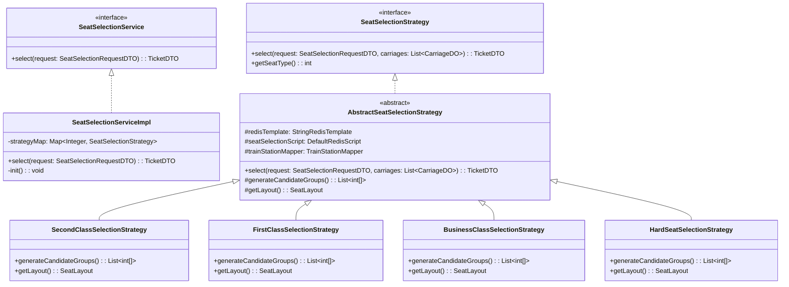
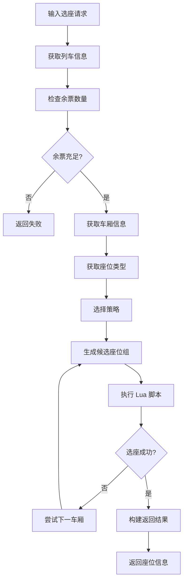
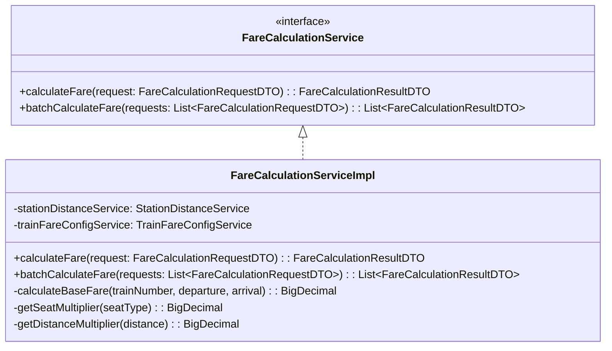
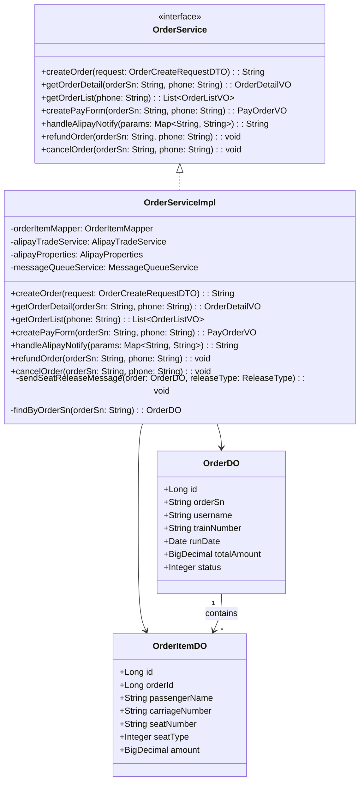
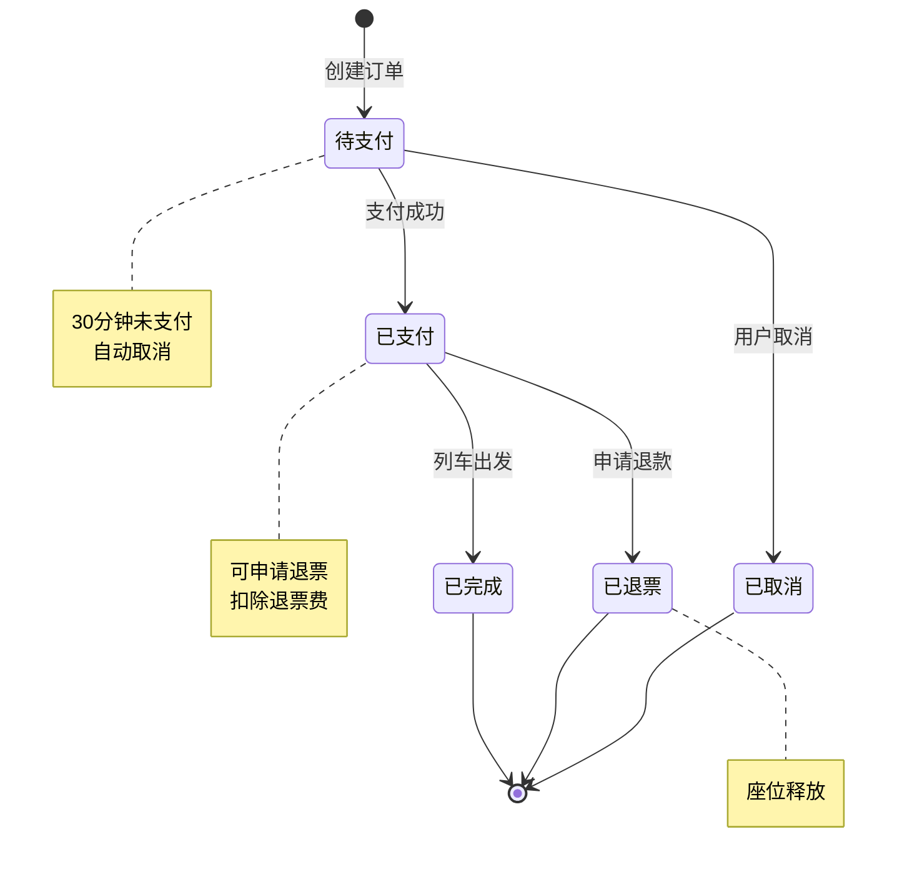
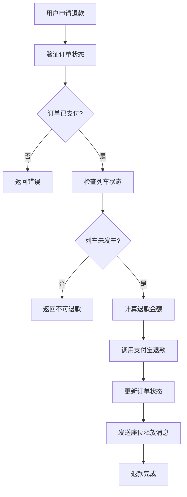
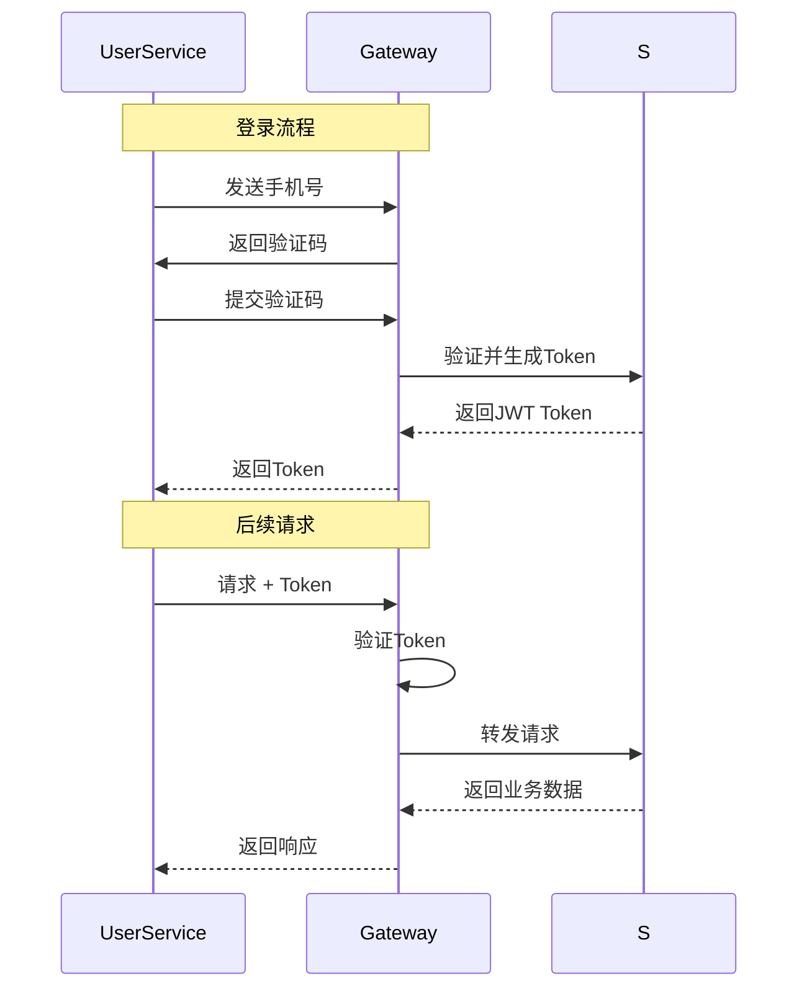
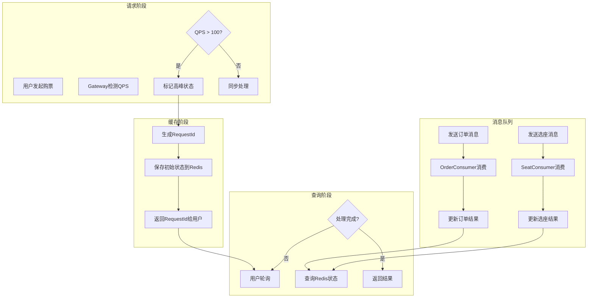

# 第5章 模块设计

## 5.1 座位选择模块

### 5.1.1 模块概述

座位选择模块是票务系统的核心模块之一，负责根据用户的选座偏好和余票情况，为用户分配座位。该模块需要处理多种座位类型（高铁二等座、一等座、商务座、动车二等座、硬座、硬卧、软卧等），并支持手动选座和自动选座两种模式。

座位选择模块的核心设计采用**策略模式**，为每种座位类型定义独立的选座策略，便于扩展和维护。

### 5.1.2 类图设计



**图5-1 座位选择模块类图**

### 5.1.3 接口定义

座位选择模块对外提供服务接口，接口定义如下：

```java
public interface SeatSelectionService {
    /**
     * 执行座位选择
     * @param request 选座请求
     * @return 选座结果
     */
    TicketDTO select(SeatSelectionRequestDTO request);
}
```

请求参数结构：

```java
public class SeatSelectionRequestDTO {
    private String trainNum;           // 车次号
    private String startStation;       // 出发站
    private String endStation;         // 到达站
    private LocalDate date;           // 乘车日期
    private String account;            // 账号
    private List<PassengerDTO> passengers;  // 乘客列表
}
```

### 5.1.4 核心算法

座位选择采用Redis Lua脚本实现原子性操作，确保并发安全。核心算法流程如图5-2所示。



**图5-2 座位选择算法流程图**

**Lua脚本实现**：

```lua
-- 座位选择Lua脚本
-- KEYS[1]: 座位详情key
-- KEYS[2]: 余票数量key
-- ARGV[1]: 起始区间
-- ARGV[2]: 结束区间
-- ARGV[3]: 乘客数量
-- ARGV[4]: 候选座位组
-- ARGV[5]: 总区间数

local detailKey = KEYS[1]
local remainingKey = KEYS[2]
local startSeg = tonumber(ARGV[1])
local endSeg = tonumber(ARGV[2])
local passengerCount = tonumber(ARGV[3])
local groupsStr = ARGV[4]
local totalSegs = tonumber(ARGV[5])

-- 获取座位详情
local seatDetails = redis.call('HMGET', detailKey, '1', '2', '3')
```

### 5.1.5 座位类型策略实现

不同座位类型的布局和选座规则不同，本系统为每种座位类型实现了独立的策略类：

| 策略类 | 座位类型 | 座位布局 |
|--------|---------|---------|
| SecondClassSelectionStrategy | 二等座 | 5座排 (A-B-C-D-F) |
| FirstClassSelectionStrategy | 一等座 | 4座排 (A-C-D-F) |
| BusinessClassSelectionStrategy | 商务座 | 3座排 (A-C-F) |
| HardSeatSelectionStrategy | 硬座 | 纯数字编号 |
| HardSleeperSelectionStrategy | 硬卧 | 上下铺布局 |
| SoftSleeperSelectionStrategy | 软卧 | 上下铺布局 |

---

## 5.2 票价计算模块

### 5.2.1 模块概述

票价计算模块负责根据列车类型、座位类型、乘车距离等因素计算实际票价。票价计算采用多因素综合定价模型，支持不同车次类型的票价上浮、淡旺季折扣等策略。

### 5.2.2 票价计算模型

票价计算公式如下：

```
票价 = 基础票价 × 车型系数 × 座位系数 × 距离系数 × 季节系数
```

其中：
- **基础票价**：根据站间距离计算
- **车型系数**：高铁1.2，动车1.0，普通车1.0
- **座位系数**：商务座2.0，一等座1.5，二等座1.0，硬座0.6
- **距离系数**：根据乘车里程查表
- **季节系数**：旺季1.15，淡季0.85

### 5.2.3 核心类设计



**图5-3 票价计算模块类图**

### 5.2.4 算法伪代码

```java
public FareCalculationResultDTO calculateFare(FareCalculationRequestDTO request) {
    // 1. 获取站间距离
    BigDecimal distance = stationDistanceService.getDistance(
        request.getTrainNumber(),
        request.getDepartureStation(),
        request.getArrivalStation()
    );

    // 2. 计算基础票价
    BigDecimal basePrice = BigDecimal.valueOf(0.5); // 每公里0.5元
    BigDecimal baseFare = basePrice.multiply(distance);

    // 3. 应用车型系数
    String trainBrand = request.getTrainBrand();
    BigDecimal trainMultiplier = getTrainMultiplier(trainBrand);

    // 4. 应用座位系数
    BigDecimal seatMultiplier = getSeatMultiplier(request.getSeatType());

    // 5. 应用距离系数
    BigDecimal distanceMultiplier = getDistanceMultiplier(distance);

    // 6. 应用季节系数
    BigDecimal seasonMultiplier = request.isPeakSeason() ?
        BigDecimal.valueOf(1.15) : BigDecimal.valueOf(0.85);

    // 7. 计算总价
    BigDecimal totalFare = baseFare
        .multiply(trainMultiplier)
        .multiply(seatMultiplier)
        .multiply(distanceMultiplier)
        .multiply(seasonMultiplier);

    return FareCalculationResultDTO.builder()
        .baseFare(baseFare)
        .trainMultiplier(trainMultiplier)
        .seatMultiplier(seatMultiplier)
        .distanceMultiplier(distanceMultiplier)
        .seasonMultiplier(seasonMultiplier)
        .totalFare(totalFare)
        .build();
}
```

---

## 5.3 订单管理模块

### 5.3.1 模块概述

订单管理模块负责处理订单的全生命周期，包括订单创建、订单支付、订单取消和订单退款等功能。该模块是系统的核心业务模块，需要保证数据一致性和事务完整性。

### 5.3.2 类图设计



**图5-4 订单管理模块类图**

### 5.3.3 订单状态机

订单状态流转如图5-5所示。



**图5-5 订单状态机**

### 5.3.4 核心流程

**订单创建流程**：

```java
@Transactional(rollbackFor = Exception.class)
public String createOrder(OrderCreateRequestDTO request) {
    // 1. 生成订单号
    String orderSn = UUID.randomUUID().toString().replace("-", "");

    // 2. 计算订单总额
    BigDecimal total = BigDecimal.ZERO;
    for (OrderItemRequestDTO item : request.getItems()) {
        if (item.getAmount() != null) {
            total = total.add(item.getAmount());
        }
    }

    // 3. 创建订单主记录
    OrderDO orderDO = new OrderDO();
    orderDO.setOrderSn(orderSn);
    orderDO.setTrainNumber(request.getTrainNumber());
    orderDO.setStartStation(request.getStartStation());
    orderDO.setEndStation(request.getEndStation());
    orderDO.setStatus(0);  // 待支付
    orderDO.setUsername(request.getUsername());
    orderDO.setRunDate(request.getRunDate());
    orderDO.setTotalAmount(total);
    this.save(orderDO);

    // 4. 创建订单明细
    for (OrderItemRequestDTO item : request.getItems()) {
        OrderItemDO itemDO = new OrderItemDO();
        itemDO.setOrderId(orderDO.getId());
        itemDO.setOrderSn(orderSn);
        itemDO.setCarriageNumber(item.getCarriageNumber());
        itemDO.setSeatNumber(item.getSeatNumber());
        itemDO.setSeatType(item.getSeatType());
        itemDO.setAmount(item.getAmount());
        // ... 其他字段
        orderItemMapper.insert(itemDO);
    }

    return orderSn;
}
```

**退款处理流程**：



**图5-6 退款处理流程图**

---

## 5.4 用户认证模块

### 5.4.1 模块概述

用户认证模块负责用户的注册、登录和身份验证。本系统采用JWT（JSON Web Token）实现无状态的身份认证，用户登录成功后获取Token，后续请求携带Token进行身份验证。

### 5.4.2 JWT认证流程



**图5-7 JWT认证流程图**

### 5.4.3 幂等性保护

本系统使用AOP切面实现幂等性保护，通过`@Idempotent`注解标记需要保证幂等性的方法：

```java
@Idempotent(
    key = "${#request.orderSn}",
    expire = 300,
    cacheResult = true,
    message = "订单已存在，请勿重复提交"
)
public Result createOrder(CreateOrderRequest request) {
    // 创建订单逻辑
}
```

---

## 5.5 异步购票处理模块

### 5.5.1 模块概述

异步购票处理模块是应对高并发场景的核心模块。在流量高峰时段，系统将购票请求通过消息队列异步处理，避免数据库压力过大。该模块使用Redis缓存存储请求状态，前端通过轮询方式查询处理结果。

### 5.5.2 处理流程



**图5-8 异步购票处理流程图**

### 5.5.3 消息消费者实现

```java
@MessageConsumer(
    topic = "seat-selection-topic",
    tag = "select",
    consumerGroup = "seat-selection-consumer"
)
public class SeatSelectionConsumer extends RocketMQBaseConsumer<SeatSelectionRequestMessage> {

    @Override
    protected void doProcess(SeatSelectionRequestMessage message) {
        // 1. 获取选座策略
        SeatSelectionStrategy strategy = strategyFactory.getStrategy(message.getSeatType());

        // 2. 执行座位选择
        TicketDTO result = strategy.select(message);

        // 3. 更新处理结果到Redis
        updateResultToCache(message.getRequestId(), result);

        // 4. 发送订单创建消息
        if (result != null) {
            messageQueueService.send("order-creation-topic", "create", buildOrderMessage(result));
        }
    }
}
```
