# 第5章 模块设计

## 5.1 座位选择模块

### 5.1.1 模块概述

座位选择模块是票务系统的核心模块之一，负责根据用户的选座偏好和余票情况，为用户分配座位。该模块需要处理多种座位类型（高铁二等座、一等座、商务座、动车二等座、硬座、硬卧、软卧等），并支持手动选座和自动选座两种模式。

座位选择模块的核心设计采用**策略模式**，为每种座位类型定义独立的选座策略，便于扩展和维护。

### 5.1.2 类图设计

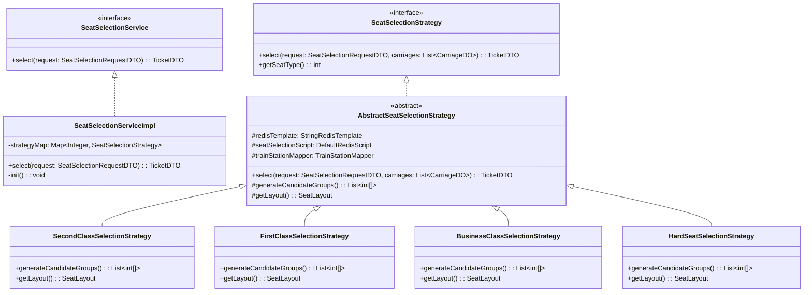

**图5-1 座位选择模块类图**

### 5.1.3 接口定义

座位选择模块对外提供服务接口，接口定义如下：

```java
public interface SeatSelectionService {
    /**
     * 执行座位选择
     * @param request 选座请求
     * @return 选座结果
     */
    TicketDTO select(SeatSelectionRequestDTO request);
}
```

请求参数结构：

```java
public class SeatSelectionRequestDTO {
    private String trainNum;           // 车次号
    private String startStation;       // 出发站
    private String endStation;         // 到达站
    private LocalDate date;           // 乘车日期
    private String account;            // 账号
    private List<PassengerDTO> passengers;  // 乘客列表
}
```

### 5.1.4 核心算法

座位选择采用Redis Lua脚本实现原子性操作，确保并发安全。核心算法流程如图5-2所示。

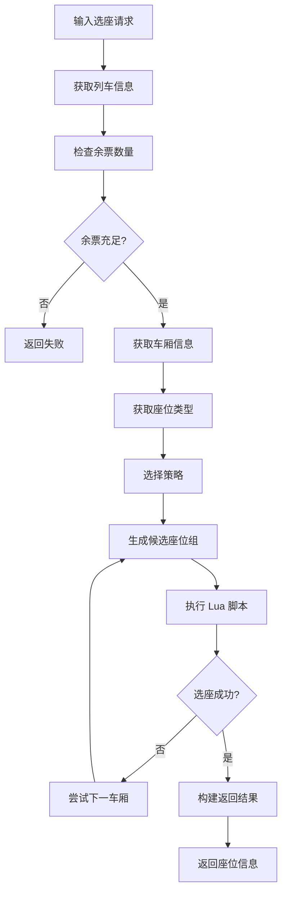

**图5-2 座位选择算法流程图**

**Lua脚本实现**：

```lua
-- 座位选择Lua脚本
-- KEYS[1]: 座位详情key
-- KEYS[2]: 余票数量key
-- ARGV[1]: 起始区间
-- ARGV[2]: 结束区间
-- ARGV[3]: 乘客数量
-- ARGV[4]: 候选座位组
-- ARGV[5]: 总区间数

local detailKey = KEYS[1]
local remainingKey = KEYS[2]
local startSeg = tonumber(ARGV[1])
local endSeg = tonumber(ARGV[2])
local passengerCount = tonumber(ARGV[3])
local groupsStr = ARGV[4]
local totalSegs = tonumber(ARGV[5])

-- 获取座位详情
local seatDetails = redis.call('HMGET', detailKey, '1', '2', '3')
```

### 5.1.5 座位类型策略实现

不同座位类型的布局和选座规则不同，本系统为每种座位类型实现了独立的策略类：

| 策略类 | 座位类型 | 座位布局 |
|--------|---------|---------|
| SecondClassSelectionStrategy | 二等座 | 5座排 (A-B-C-D-F) |
| FirstClassSelectionStrategy | 一等座 | 4座排 (A-C-D-F) |
| BusinessClassSelectionStrategy | 商务座 | 3座排 (A-C-F) |
| HardSeatSelectionStrategy | 硬座 | 纯数字编号 |
| HardSleeperSelectionStrategy | 硬卧 | 上下铺布局 |
| SoftSleeperSelectionStrategy | 软卧 | 上下铺布局 |

---

## 5.2 票价计算模块

### 5.2.1 模块概述

票价计算模块负责根据列车类型、座位类型、乘车距离等因素计算实际票价。票价计算采用多因素综合定价模型，支持不同车次类型的票价上浮、淡旺季折扣等策略。

### 5.2.2 票价计算模型

票价计算公式如下：

```
票价 = 基础票价 × 车型系数 × 座位系数 × 距离系数 × 季节系数
```

其中：
- **基础票价**：根据站间距离计算
- **车型系数**：高铁1.2，动车1.0，普通车1.0
- **座位系数**：商务座2.0，一等座1.5，二等座1.0，硬座0.6
- **距离系数**：根据乘车里程查表
- **季节系数**：旺季1.15，淡季0.85

### 5.2.3 核心类设计

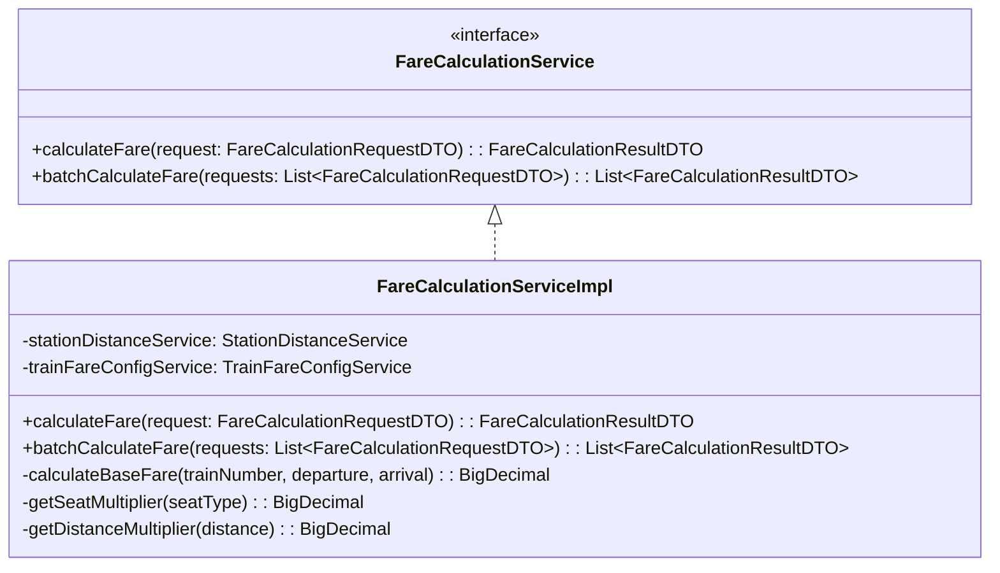

**图5-3 票价计算模块类图**

### 5.2.4 算法伪代码

```java
public FareCalculationResultDTO calculateFare(FareCalculationRequestDTO request) {
    // 1. 获取站间距离
    BigDecimal distance = stationDistanceService.getDistance(
        request.getTrainNumber(),
        request.getDepartureStation(),
        request.getArrivalStation()
    );

    // 2. 计算基础票价
    BigDecimal basePrice = BigDecimal.valueOf(0.5); // 每公里0.5元
    BigDecimal baseFare = basePrice.multiply(distance);

    // 3. 应用车型系数
    String trainBrand = request.getTrainBrand();
    BigDecimal trainMultiplier = getTrainMultiplier(trainBrand);

    // 4. 应用座位系数
    BigDecimal seatMultiplier = getSeatMultiplier(request.getSeatType());

    // 5. 应用距离系数
    BigDecimal distanceMultiplier = getDistanceMultiplier(distance);

    // 6. 应用季节系数
    BigDecimal seasonMultiplier = request.isPeakSeason() ?
        BigDecimal.valueOf(1.15) : BigDecimal.valueOf(0.85);

    // 7. 计算总价
    BigDecimal totalFare = baseFare
        .multiply(trainMultiplier)
        .multiply(seatMultiplier)
        .multiply(distanceMultiplier)
        .multiply(seasonMultiplier);

    return FareCalculationResultDTO.builder()
        .baseFare(baseFare)
        .trainMultiplier(trainMultiplier)
        .seatMultiplier(seatMultiplier)
        .distanceMultiplier(distanceMultiplier)
        .seasonMultiplier(seasonMultiplier)
        .totalFare(totalFare)
        .build();
}
```

---

## 5.3 订单管理模块

### 5.3.1 模块概述

订单管理模块负责处理订单的全生命周期，包括订单创建、订单支付、订单取消和订单退款等功能。该模块是系统的核心业务模块，需要保证数据一致性和事务完整性。

### 5.3.2 类图设计

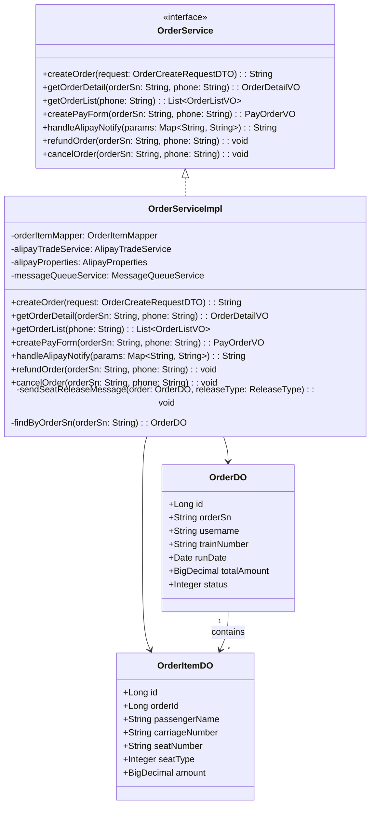

**图5-4 订单管理模块类图**

### 5.3.3 订单状态机

订单状态流转如图5-5所示。

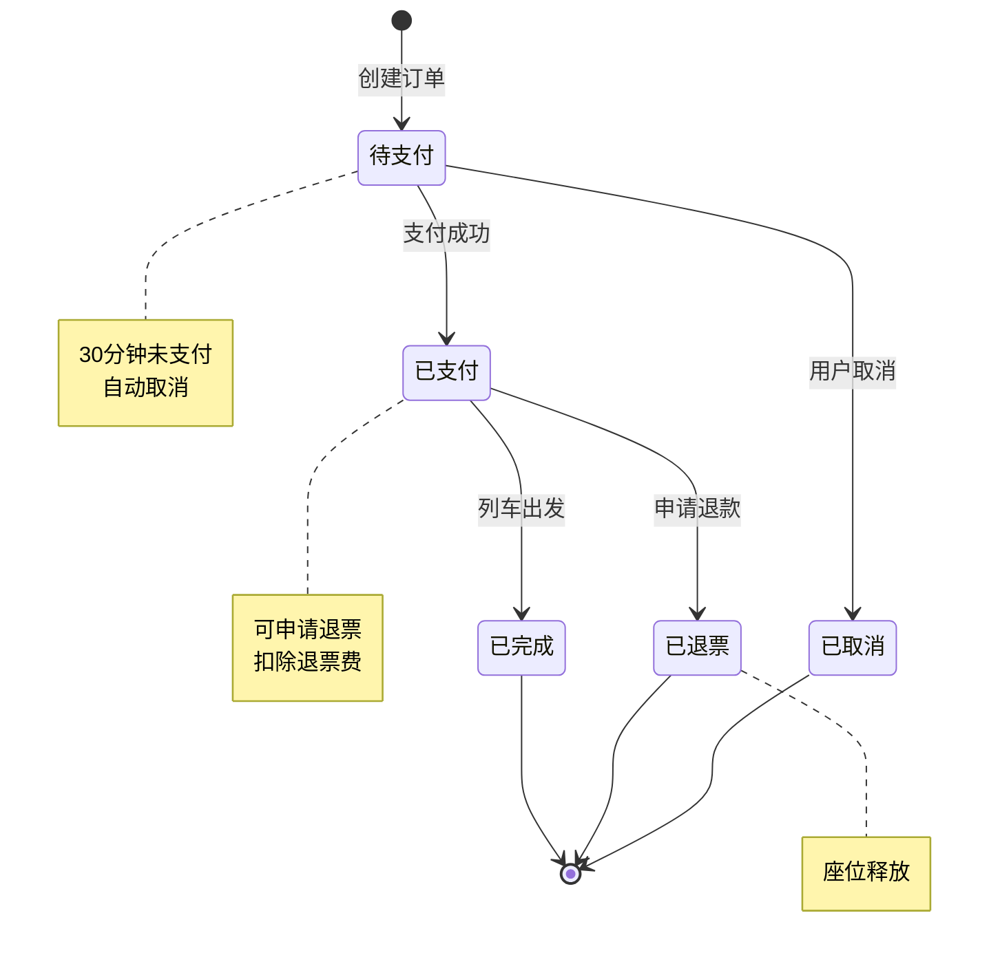

**图5-5 订单状态机**

### 5.3.4 核心流程

**订单创建流程**：

```java
@Transactional(rollbackFor = Exception.class)
public String createOrder(OrderCreateRequestDTO request) {
    // 1. 生成订单号
    String orderSn = UUID.randomUUID().toString().replace("-", "");

    // 2. 计算订单总额
    BigDecimal total = BigDecimal.ZERO;
    for (OrderItemRequestDTO item : request.getItems()) {
        if (item.getAmount() != null) {
            total = total.add(item.getAmount());
        }
    }

    // 3. 创建订单主记录
    OrderDO orderDO = new OrderDO();
    orderDO.setOrderSn(orderSn);
    orderDO.setTrainNumber(request.getTrainNumber());
    orderDO.setStartStation(request.getStartStation());
    orderDO.setEndStation(request.getEndStation());
    orderDO.setStatus(0);  // 待支付
    orderDO.setUsername(request.getUsername());
    orderDO.setRunDate(request.getRunDate());
    orderDO.setTotalAmount(total);
    this.save(orderDO);

    // 4. 创建订单明细
    for (OrderItemRequestDTO item : request.getItems()) {
        OrderItemDO itemDO = new OrderItemDO();
        itemDO.setOrderId(orderDO.getId());
        itemDO.setOrderSn(orderSn);
        itemDO.setCarriageNumber(item.getCarriageNumber());
        itemDO.setSeatNumber(item.getSeatNumber());
        itemDO.setSeatType(item.getSeatType());
        itemDO.setAmount(item.getAmount());
        // ... 其他字段
        orderItemMapper.insert(itemDO);
    }

    return orderSn;
}
```

**退款处理流程**：

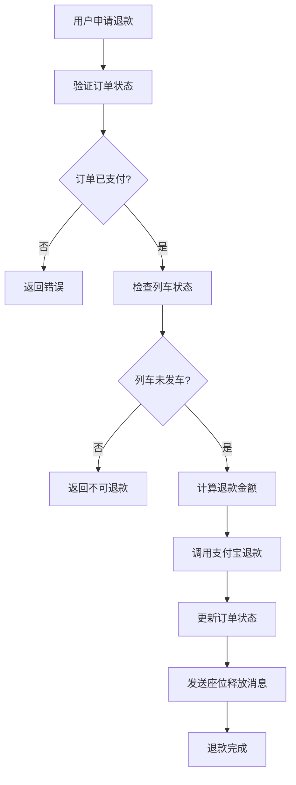

**图5-6 退款处理流程图**

---

## 5.4 用户认证模块

### 5.4.1 模块概述

用户认证模块负责用户的注册、登录和身份验证。本系统采用JWT（JSON Web Token）实现无状态的身份认证，用户登录成功后获取Token，后续请求携带Token进行身份验证。

### 5.4.2 JWT认证流程

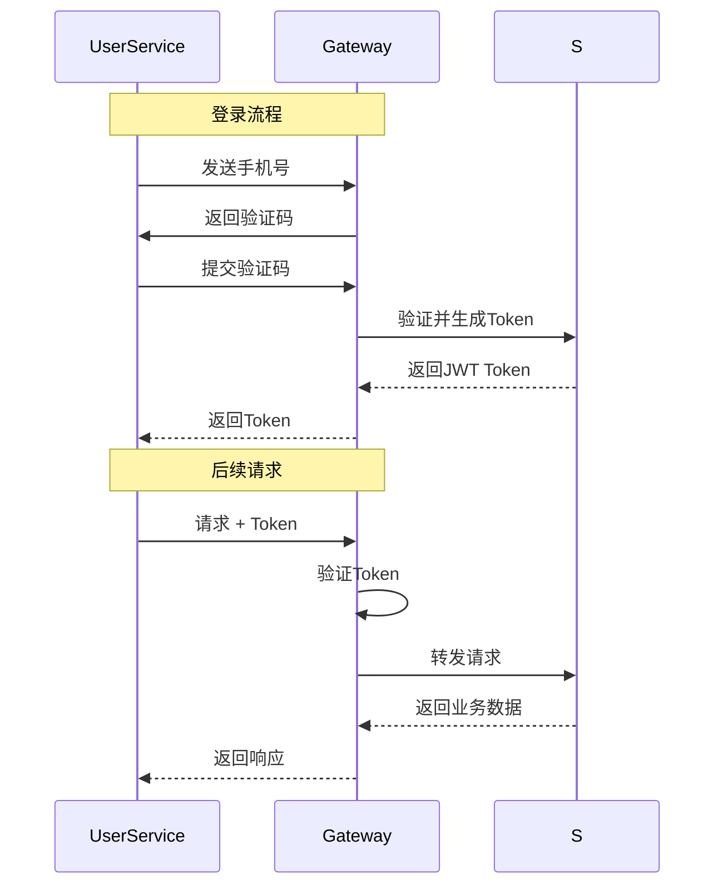

**图5-7 JWT认证流程图**

### 5.4.3 幂等性保护

本系统使用AOP切面实现幂等性保护，通过`@Idempotent`注解标记需要保证幂等性的方法：

```java
@Idempotent(
    key = "${#request.orderSn}",
    expire = 300,
    cacheResult = true,
    message = "订单已存在，请勿重复提交"
)
public Result createOrder(CreateOrderRequest request) {
    // 创建订单逻辑
}
```

---

## 5.5 候补订单模块

### 5.5.1 模块概述

候补订单模块是系统的核心功能模块之一，用于处理无票情况下的排队等候业务。当车票售罄时，用户可提交候补订单，系统将其加入优先级队列，实时检测余票释放，一旦有票自动为用户选座并创建订单。

候补订单采用**全异步MQ驱动架构**，与普通购票的高峰异步模式不同，候补订单始终走异步流程，通过多个Topic串联形成完整处理链路。

### 5.5.2 候补订单状态机

候补订单具有独立的状态流转，状态定义如下：

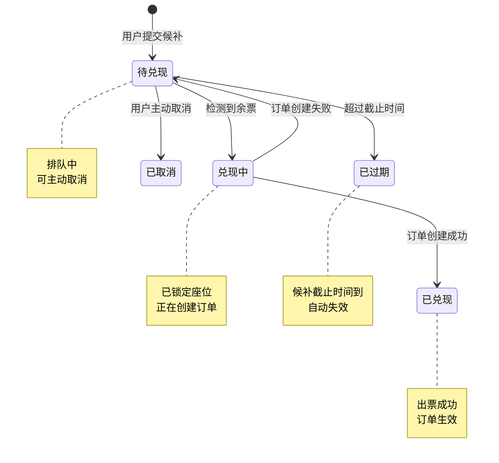

**图5-9 候补订单状态机**

### 5.5.3 优先级计算模型

候补队列采用Redis ZSet实现，优先级分数决定排队顺序。分数计算规则如下：

```
总分 = 时间因子 - 队列拥堵惩罚 - 失败惩罚 × 失败次数

时间因子 = -创建时间戳 / 1,000,000,000
  - 越早候补，时间戳越小（负值越大），分数越高
  - 当前约 -1700 分左右
  
队列拥堵惩罚 = MIN(当前队列人数 × 0.1, 20)
  - 排队人数越多，惩罚越大
  - 上限20分

失败惩罚 = 10分（每次失败固定扣分）
```

**简化版本**（当前实现）：
- VIP加成：暂不启用（固定0分）
- 历史购票加成：暂不启用（固定0分）
- 乘客类型加成：暂不启用（固定成人0分）

优先级分数示例：
```
用户A：创建时间早，队列10人 → -1700 - 1 = -1701分
用户B：创建时间晚，队列10人 → -1699 - 1 = -1700分
→ 用户A优先级更高（分数越小越优先，ZSet用popMax取出最大分数）
```

> **注意**：实际Redis ZSet中，score存储为负值，`popMax`会弹出最大的负数（即绝对值最小的负数），对应最早的订单。当前实现使用 `BigDecimal` 转 `double` 存储。

### 5.5.4 消息驱动处理链路

候补订单采用**事件驱动架构**，仅在退票或新增座位时触发兑现流程。完整处理链路如下：

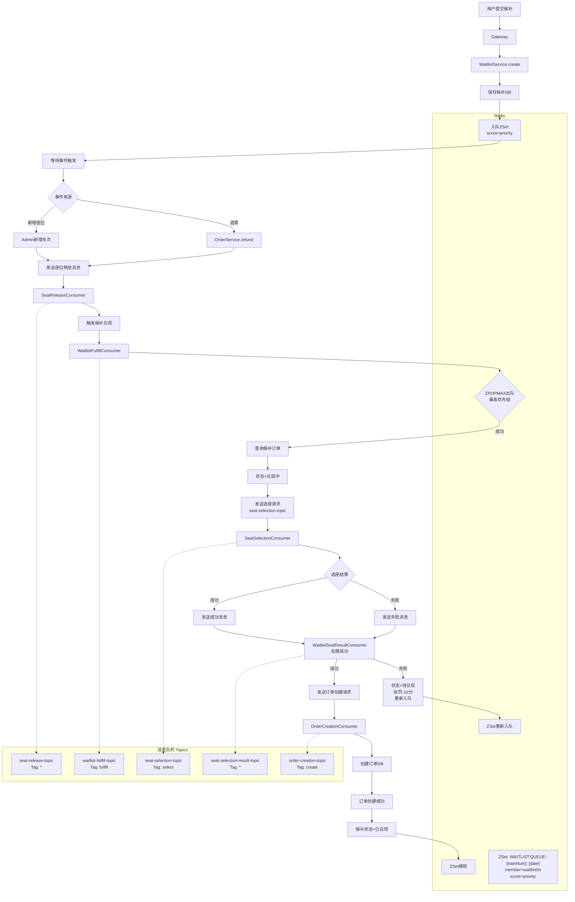

**图5-10 候补订单MQ消息处理链路**

### 5.5.5 核心消费者实现

#### 5.5.5.1 WaitlistFulfillConsumer（候补兑现消费者）

**类路径**：`com.lalal.modules.consumer.WaitlistFulfillConsumer`

**监听配置**：
```java
@MessageConsumer(
    topic = "waitlist-fulfill-topic",
    tag = "fulfill",
    consumerGroup = "waitlist-fulfill-consumer"
)
@RocketMQMessageListener(
    topic = "waitlist-fulfill-topic",
    consumerGroup = "waitlist-fulfill-consumer",
    selectorExpression = "fulfill"
)
```

**触发时机**：
- 用户退票 → `SeatReleaseConsumer` 发送 `WaitlistFulfillMessage`
- 新增车次/座位 → 管理端发送 `WaitlistFulfillMessage`

**处理逻辑**：
1. 从Redis ZSet队列出队（ZPOPMAX原子弹出最高优先级订单）
2. 查询候补订单，校验状态（仅处理"待兑现"(0)状态）
3. 检查截止时间，过期订单标记为"已过期"(4)
4. 更新状态为"兑现中"(1)
5. 发送选座请求到 `seat-selection-topic`（`source="WAITLIST"`）

**核心代码**：
```java
// ZPOPMAX 原子弹出最高分数的成员
String waitlistSn = waitlistQueueService.dequeue(trainNumber, travelDate);
if (waitlistSn == null) {
    log.info("[候补兑现] 队列为空，无需处理");
    return;
}
```

#### 5.5.5.2 WaitlistSeatResultConsumer（候补选座结果消费者）

**类路径**：`com.lalal.modules.consumer.WaitlistSeatResultConsumer`

**监听配置**：
```java
@MessageConsumer(
    topic = "seat-selection-result-topic",
    tag = "*",
    consumerGroup = "waitlist-seat-result-consumer"
)
@RocketMQMessageListener(
    topic = "seat-selection-result-topic",
    consumerGroup = "waitlist-seat-result-consumer",
    selectorExpression = "*"
)
```

**处理逻辑**：
1. 查询候补订单，校验状态（仅处理"兑现中"(1)状态）
2. **选座成功**：
   - 构建 `OrderCreationRequestMessage`（携带 `waitlistSn`）
   - 发送到 `order-creation-topic`
   - `OrderCreationConsumer` 创建订单成功后，更新候补状态为"已兑现"(2)，从ZSet移除
3. **选座失败**：
   - 更新候补状态为"待兑现"(0)
   - 优先级惩罚 -10 分，重新入队ZSet
   - 触发下次兑现尝试

**核心代码**：
```java
if (message.isSuccess() && message.getSelectedSeats() != null && !message.getSelectedSeats().isEmpty()) {
    // 选座成功：发送订单创建请求
    handleSuccess(order, message);
} else {
    // 选座失败：回滚状态，重新入队
    handleFailure(order, message.getErrorMessage());
}
```

#### 5.5.5.3 SeatReleaseConsumer（座位释放消费者）

**类路径**：`com.lalal.modules.consumer.SeatReleaseConsumer`

**触发候补**：在座位释放完成后，发送 `WaitlistFulfillMessage` 到 `waitlist-fulfill-topic`，触发候补兑现流程。

**核心代码**：
```java
private void triggerWaitlistFulfillment(SeatReleaseMessage message) {
    message.getSeats().stream()
        .map(SeatReleaseMessage.SeatItem::getSeatType)
        .distinct()
        .forEach(seatType -> {
            WaitlistFulfillMessage fulfillMsg = WaitlistFulfillMessage.builder()
                .trainNumber(message.getTrainNum())
                .travelDate(message.getDate())
                .seatType(seatType)
                .source(message.getReleaseType().name())
                .timestamp(System.currentTimeMillis())
                .build();
            messageQueueService.send(WAITLIST_FULFILL_TOPIC, "fulfill", fulfillMsg);
        });
}
```

### 5.5.6 Redis数据结构设计

候补订单的缓存和队列管理依赖以下Redis结构：

#### 5.5.6.1 优先级队列（ZSet）

```bash
# Key格式
WAITLIST:QUEUE::{trainNumber}::{travelDate}

# 成员与分数
ZADD WAITLIST:QUEUE::G1234::2026-04-20 \
    -1699.50 WL001ABCD12345678 \
    -1701.25 WL002EFGH90123456

# 取出最高优先级（分数最大，即最不负值）
ZPOPMAX WAITLIST:QUEUE::G1234::2026-04-20 1
# 返回: ["WL001ABCD12345678", -1699.50]

# 更新优先级
ZADD WAITLIST:QUEUE::G1234::2026-04-20 -1709.25 WL002EFGH90123456
```

#### 5.5.6.2 候补详情（Hash）

```bash
# Key格式
WAITLIST:DETAIL::{waitlistSn}

# 字段
HMSET WAITLIST:DETAIL::WL001ABCD12345678 \
    waitlistSn "WL001ABCD12345678" \
    username "13800138000" \
    trainNumber "G1234" \
    startStation "北京南" \
    endStation "上海虹桥" \
    travelDate "2026-04-20" \
    seatTypes "1,2" \
    status "0" \
    priority "-1699.50" \
    deadline "2026-04-20T10:00:00" \
    createTime "2026-04-12T08:30:00"
```

#### 5.5.6.3 幂等性锁（String）

```bash
# 每个检查消息携带唯一requestId
SETNX WAITLIST:MSGID::req_001 1
EXPIRE WAITLIST:MSGID::req_001 1800  # 30分钟
```

#### 5.5.6.4 异步请求跟踪（Hash）

```bash
# Key: ticket:async:req:{requestId}
# 记录requestId与waitlistSn的映射关系
HMSET ticket:async:req:req_001 \
    requestId "req_001" \
    waitlistSn "WL001ABCD12345678" \
    source "WAITLIST" \
    trainNum "G1234" \
    date "2026-04-20" \
    status "0"
EXPIRE ticket:async:req:req_001 1800
```

### 5.5.7 定时任务设计

候补订单服务包含一个定时任务，定期扫描待兑现订单并触发检查：

```java
@Scheduled(cron = "0 */5 * * * ?")  // 每5分钟执行一次
@Override
public void checkAndFulfillWaitlistOrders() {
    log.debug("[候补订单] 开始批量扫描待兑现订单...");
    
    // 1. 扫描待兑现且未过期的订单
    LambdaQueryWrapper<WaitlistOrderDO> wrapper = new LambdaQueryWrapper<>();
    wrapper.eq(WaitlistOrderDO::getStatus, 0);  // 待兑现
    wrapper.gt(WaitlistOrderDO::getDeadline, new Date());  // 未过期
    wrapper.orderByAsc(WaitlistOrderDO::getCreateTime);  // 先到先得
    
    List<WaitlistOrderDO> pendingOrders = this.list(wrapper);
    
    // 2. 对每个订单发送检查消息（延迟5秒，避免与创建事务冲突）
    for (WaitlistOrderDO order : pendingOrders) {
        try {
            sendCheckMessage(order);  // 延迟5秒
        } catch (Exception e) {
            log.error("[候补订单] 发送检查消息失败: waitlistSn={}", 
                      order.getWaitlistSn(), e);
        }
    }
    
    // 3. 扫描并处理过期订单
    handleExpiredOrders();
}
```

### 5.5.8 候补订单实体设计

**数据表**：`t_waitlist_order`

```java
@Data
@TableName("t_waitlist_order")
public class WaitlistOrderDO extends BaseDO {
    /**
     * 候补订单号（唯一）
     * 生成规则: WL + UUID(16位大写)
     * 示例: WLABCDEF12345678
     */
    private String waitlistSn;
    
    /**
     * 用户名（关联t_user）
     */
    private String username;
    
    /**
     * 车次号
     */
    private String trainNumber;
    
    /**
     * 出发站
     */
    private String startStation;
    
    /**
     * 到达站
     */
    private String endStation;
    
    /**
     * 乘车日期
     */
    private LocalDate travelDate;
    
    /**
     * 座位类型列表（JSON数组字符串）
     * 示例: "1,2" 表示二等座、一等座
     */
    private String seatTypes;
    
    /**
     * 乘车人ID列表（逗号分隔）
     * 示例: "1001,1002"
     */
    private String passengerIds;
    
    /**
     * 预付金额
     */
    private BigDecimal prepayAmount;
    
    /**
     * 候补截止时间
     * 到达截止时间仍未兑现则自动过期
     */
    private Date deadline;
    
    /**
     * 状态：0-待兑现，1-兑现中，2-已兑现，3-已取消，4-已过期
     */
    private Integer status;
    
    /**
     * 兑现后的订单号（成功出票后填充）
     */
    private String fulfilledOrderSn;
    
    /**
     * 优先级分数（Decimal存储，Redis ZSet使用double）
     * 分数越高优先级越高
     */
    private BigDecimal priorityScore;
    
    /**
     * 失败重试次数（用于统计和监控）
     */
    private Integer retryCount;
}
```

### 5.5.9 MQ Topic与消息定义

候补订单流程涉及的核心Topic如下：

| Topic | Tag | 生产者 | 消费者 | 消息体 | 说明 |
|-------|-----|--------|--------|--------|------|
| `waitlist-fulfill-topic` | `fulfill` | SeatReleaseConsumer | WaitlistFulfillConsumer | `WaitlistFulfillMessage` | 候补兑现触发 |
| `seat-selection-topic` | `select` | WaitlistFulfillConsumer | SeatSelectionConsumer | `SeatSelectionRequestMessage`（source=WAITLIST） | 选座请求 |
| `seat-selection-result-topic` | `*` | SeatSelectionConsumer | WaitlistSeatResultConsumer | `SeatSelectionResultMessage`（含waitlistSn） | 选座结果 |
| `order-creation-topic` | `create` | WaitlistSeatResultConsumer | OrderCreationConsumer | `OrderCreationRequestMessage`（含waitlistSn） | 订单创建请求 |
---

## 5.6 异步购票处理模块

### 5.6.1 模块概述

异步购票处理模块负责处理高峰时段的购票请求。系统采用纯MQ消息驱动架构，购票请求通过多个Topic串联形成完整的处理链路。

### 5.6.2 消息处理链路

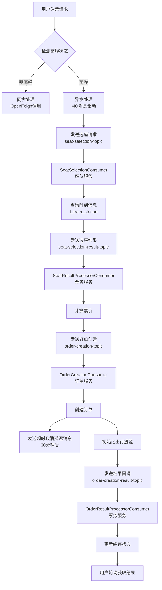

**图5-11 异步购票消息处理链路**

### 5.6.3 核心消费者实现

#### 5.6.3.1 SeatResultProcessorConsumer（选座结果处理器）

**类路径**：`com.lalal.modules.consumer.SeatResultProcessorConsumer`

**监听配置**：
```java
@MessageConsumer(
    topic = "seat-selection-result-topic",
    tag = "*",
    consumerGroup = "seat-result-processor-consumer"
)
```

**处理逻辑**：
1. 从消息中获取时刻信息（`planDepartTime`、`planArrivalTime`）
2. 获取乘客信息（调用user-service）
3. 计算票价（调用票价计算服务）
4. 构建订单创建请求，传递时刻信息
5. 发送到 `order-creation-topic`

### 5.6.3.2 OrderResultProcessorConsumer（订单结果处理器）

**类路径**：`com.lalal.modules.consumer.OrderResultProcessorConsumer`

**监听配置**：
```java
@MessageConsumer(
    topic = "order-creation-result-topic",
    tag = "*",
    consumerGroup = "order-result-processor-consumer"
)
```

**处理逻辑**：
1. 从缓存获取异步请求状态
2. 成功：更新缓存中的订单号和状态
3. 失败：发送座位释放消息到 `seat-release-topic`

---

## 5.7 出行提醒模块

### 5.7.1 模块概述

出行提醒模块为已支付订单用户提供行程提醒服务。系统在发车前1小时、30分钟和到达后发送提醒消息。

### 5.7.2 版本控制机制

为防止订单取消/改签后发送过期提醒，系统采用版本控制机制：

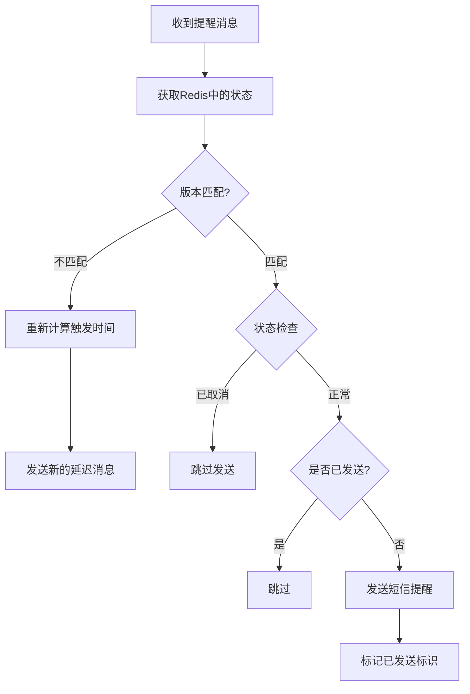

**图5-12 出行提醒版本控制流程**

### 5.7.3 状态标识设计

| 状态常量 | 值 | 说明 |
|---------|-----|------|
| STATUS_NORMAL | 0 | 正常状态 |
| STATUS_DELAY | 1 | 列车晚点 |
| STATUS_CANCEL | 2 | 列车停运 |
| STATUS_ORDER_CANCEL | 4 | 订单已取消 |

**已发送标识（位掩码）**：

| 标识 | 值 | 说明 |
|------|-----|------|
| FLAG_1H_SENT | 1 | 发车前1小时提醒已发送 |
| FLAG_30M_SENT | 2 | 发车前30分钟提醒已发送 |
| FLAG_ARRIVAL_SENT | 4 | 到达提醒已发送 |

### 5.7.4 Redis数据结构

```bash
# Key: REMINDER::STATE::{orderSn}
HMSET REMINDER::STATE::order_abc123 \
    version "1" \
    status "0" \
    planDepartTime "1714089600000" \
    planArrivalTime "1714104000000" \
    sentFlags "0" \
    trainNumber "G1234" \
    startStation "北京南" \
    endStation "上海虹桥"
```

---

## 5.8 订单超时取消模块

### 5.8.1 模块概述

订单超时取消模块确保未支付订单在30分钟后自动取消，释放座位资源。

### 5.8.2 延迟队列实现

系统利用RocketMQ的延迟消息功能实现超时取消：

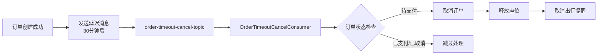

**图5-13 订单超时取消流程**

### 5.8.3 消费者实现

```java
@Override
protected void doProcess(Object msg) {
    OrderCreationResultMessage message = (OrderCreationResultMessage) msg;
    String orderSn = message.getOrderSn();
    
    OrderDO order = orderService.findByOrderSn(orderSn);
    
    // 仅取消待支付订单
    if (order != null && Objects.equals(order.getStatus(), 0)) {
        orderService.cancelOrder(orderSn);
        // 发送座位释放消息
        sendSeatReleaseMessage(order, SeatReleaseMessage.ReleaseType.TIMEOUT);
        // 取消出行提醒
        reminderService.handleOrderCancel(orderSn);
    }
}
```

---

## 5.9 时刻信息传递机制

### 5.9.1 设计背景

出行提醒需要准确的计划发车时间和到达时间。为避免order-service直接查询ticket-service的数据库造成服务耦合，系统采用消息传递机制，由seat-service查询时刻信息后随消息传递。

### 5.9.2 数据流转

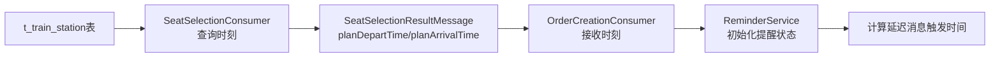

**图5-14 时刻信息数据流转**

### 5.9.3 时刻查询逻辑

```java
// SeatSelectionConsumer.fillPlanTimes()
// 查询出发站发车时间
TrainStationDO departStation = trainStationMapper.selectOne(
    new LambdaQueryWrapper<TrainStationDO>()
        .eq(TrainStationDO::getTrainId, trainId)
        .eq(TrainStationDO::getStationName, startStation)
);
planDepartTime = runDate.atTime(departStation.getDepartureTime())
    .atZone(ZoneId.systemDefault()).toInstant().toEpochMilli();

// 查询到达站到达时间（考虑跨天）
TrainStationDO arriveStation = trainStationMapper.selectOne(...);
int arriveDayDiff = arriveStation.getArriveDayDiff() != null 
    ? arriveStation.getArriveDayDiff() : 0;
LocalDate arriveDate = runDate.plusDays(arriveDayDiff);
planArrivalTime = arriveDate.atTime(arriveStation.getArrivalTime())
    .atZone(ZoneId.systemDefault()).toInstant().toEpochMilli();
```

### 5.9.4 消息字段扩展

为支持时刻信息传递，以下消息DTO新增字段：

**SeatSelectionResultMessage**：
```java
private Long planDepartTime;    // 计划发车时间（毫秒时间戳）
private Long planArrivalTime;   // 计划到达时间（毫秒时间戳）
```

**OrderCreationRequestMessage**：
```java
private Long planDepartTime;    // 计划发车时间
private Long planArrivalTime;   // 计划到达时间
```

---

## 5.10 MQ Topic汇总

系统涉及的所有消息Topic汇总如下：

| Topic | Tag | 生产者服务 | 消费者服务 | 用途 |
|-------|-----|-----------|-----------|------|
| `seat-selection-topic` | select | ticket-service, order-service | seat-service | 选座请求 |
| `seat-selection-result-topic` | result | seat-service | ticket-service, order-service | 选座结果返回 |
| `order-creation-topic` | create | ticket-service, order-service | order-service | 订单创建请求 |
| `order-creation-result-topic` | result | order-service | ticket-service | 订单创建结果回调 |
| `order-timeout-cancel-topic` | cancel | order-service | order-service | 订单超时取消（延迟30分钟） |
| `travel-reminder-topic` | * | order-service | order-service | 出行提醒（延迟消息） |
| `seat-release-topic` | * | order-service, ticket-service | seat-service | 座位释放，触发候补兑现 |
| `waitlist-fulfill-topic` | fulfill | seat-service | order-service | 候补兑现触发 |

**消息定义（Frameworks/common 模块）**：

1. **WaitlistFulfillMessage** - 候补兑现触发消息
```java
@Data
public class WaitlistFulfillMessage implements Serializable {
    private String trainNumber;      // 车次
    private String travelDate;       // 乘车日期 yyyy-MM-dd
    private Integer seatType;        // 座位类型（可选）
    private String source;           // 触发来源：REFUND/NEW_SEAT
    private Long timestamp;          // 时间戳
}
```

2. **SeatSelectionRequestMessage** - 选座请求（已有）
```java
// 关键字段
private String source;              // "WAITLIST" 或 "NORMAL"
private String waitlistSn;          // 候补订单号（source=WAITLIST时必填）
```

3. **SeatSelectionResultMessage** - 选座结果（扩展字段waitlistSn）
```java
@Data
public class SeatSelectionResultMessage implements Serializable {
    private String requestId;        // 全局请求ID
    private String waitlistSn;       // 候补订单号（候补订单使用）
    private boolean success;         // 选座是否成功
    private List<SeatItem> selectedSeats; // 选中的座位
    private String errorMessage;     // 失败时的错误信息
    private Long timestamp;          // 时间戳
}
```

4. **OrderCreationRequestMessage** - 订单创建请求（扩展字段waitlistSn）
```java
@Data
public class OrderCreationRequestMessage implements Serializable {
    private String requestId;        // 全局请求ID
    private String waitlistSn;       // 候补订单号（候补订单使用）
    private String trainNum;         // 车次号
    private String startStation;     // 出发站
    private String endStation;       // 到达站
    private String username;         // 用户账号
    private LocalDate runDate;       // 乘车日期
    private List<OrderItem> items;   // 订单项列表
}
```

### 5.5.10 候补订单管理服务

**接口定义**：`com.lalal.modules.service.WaitlistService`

**核心方法**：

| 方法 | 说明 |
|------|------|
| `createWaitlist(WaitlistCreateRequestDTO)` | 创建候补订单，入队并发送检查消息 |
| `cancelWaitlist(String waitlistSn, String username)` | 取消候补订单，从队列移除 |
| `getWaitlistOrders(String username)` | 获取用户候补列表 |
| `getWaitlistDetail(String waitlistSn, String username)` | 获取候补详情 |
| `checkAndFulfillWaitlistOrders()` | 定时任务：批量扫描并发送检查 |
| `findByWaitlistSn(String waitlistSn)` | 根据候补订单号查询 |
| `updateWaitlistStatus(String waitlistSn, Integer status)` | 更新状态 |
| `recalculatePriority(WaitlistOrderDO order)` | 重新计算优先级（正常） |
| `recalculatePriorityWithPenalty(WaitlistOrderDO order)` | 优先级惩罚（失败扣10分） |

**实现类**：`WaitlistServiceImpl`

核心流程：
```java
@Override
@Transactional(rollbackFor = Exception.class)
public String createWaitlist(WaitlistCreateRequestDTO request) {
    // 1. 幂等性检查（Redis缓存去重）
    String dedupKey = DEDUP_KEY_PREFIX + request.getAccount() + ":" +
                      request.getTrainNumber() + ":" + request.getTravelDate();
    String existingSn = safeCacheTemplate.get(dedupKey, String.class);
    if (existingSn != null) {
        WaitlistOrderDO existing = findByWaitlistSn(existingSn);
        if (existing != null && existing.getStatus() == 0) {
            throw new IllegalStateException("您已提交过候补订单，请勿重复提交");
        }
    }
    
    // 2. 构建并保存候补订单
    String waitlistSn = generateWaitlistSn();
    WaitlistOrderDO order = buildOrder(request, waitlistSn);
    this.save(order);
    
    // 3. 计算初始优先级（简化版：仅时间因子+队列惩罚）
    BigDecimal priority = priorityCalculator.calculatePriority(
        order, 0, 0L, 
        waitlistQueueService.getQueueSize(trainNumber, travelDate, null)
    );
    
    // 4. 入队Redis ZSet
    waitlistQueueService.enqueue(order, priority);
    
    // 5. 缓存幂等键（TTL=截止时间-当前时间）
    safeCacheTemplate.set(dedupKey, waitlistSn, ttlMinutes, MINUTES);
    
    // 6. 发送检查消息（延迟5秒）
    sendCheckMessage(order);
    
    return waitlistSn;
}
```

### 5.5.11 候补队列服务

**接口**：`com.lalal.modules.service.WaitlistQueueService`

**实现**：`WaitlistQueueServiceImpl`

```java
@Service
@RequiredArgsConstructor
public class WaitlistQueueServiceImpl implements WaitlistQueueService {
    
    private final StringRedisTemplate stringRedisTemplate;
    
    /**
     * 入队：将候补订单加入优先级队列
     * Key: WAITLIST:QUEUE::{trainNumber}::{travelDate}
     * Score: priority (BigDecimal转double，分数越高越优先)
     */
    @Override
    public void enqueue(WaitlistOrderDO order, BigDecimal priority) {
        String key = buildKey(order.getTrainNumber(), order.getTravelDate().toString());
        stringRedisTemplate.opsForZSet().add(
            key, 
            order.getWaitlistSn(), 
            priority.doubleValue()
        );
    }
    
    /**
     * 出队：弹出优先级最高的候补订单
     * 使用ZPOPMAX原子操作
     */
    @Override
    public String dequeue(String trainNumber, String travelDate, Integer seatType) {
        String key = buildKey(trainNumber, travelDate);
        Set<ZSetOperations.TypedTuple<String>> popped = 
            stringRedisTemplate.opsForZSet().popMax(key, 1);
        if (popped != null && !popped.isEmpty()) {
            return popped.iterator().next().getValue();
        }
        return null;
    }
    
    /**
     * 获取队列大小
     */
    @Override
    public Long getQueueSize(String trainNumber, String travelDate, Integer seatType) {
        String key = buildKey(trainNumber, travelDate);
        return stringRedisTemplate.opsForZSet().zCard(key);
    }
    
    /**
     * 获取排队位置（排名）
     * score越小排名越前（ZSET默认升序），需反转计算
     */
    @Override
    public Long getQueuePosition(String waitlistSn, String trainNumber, String travelDate) {
        String key = buildKey(trainNumber, travelDate);
        Long rank = stringRedisTemplate.opsForZSet().rank(key, waitlistSn);
        return rank == null ? null : rank + 1;
    }
    
    /**
     * 移除候补订单
     */
    @Override
    public void remove(String waitlistSn, String trainNumber, String travelDate) {
        String key = buildKey(trainNumber, travelDate);
        stringRedisTemplate.opsForZSet().remove(key, waitlistSn);
    }
    
    /**
     * 更新优先级分数
     */
    @Override
    public void updatePriority(String waitlistSn, String trainNumber, 
                               String travelDate, BigDecimal newPriority) {
        String key = buildKey(trainNumber, travelDate);
        stringRedisTemplate.opsForZSet().add(
            key, waitlistSn, newPriority.doubleValue()
        );
    }
    
    private String buildKey(String trainNumber, String travelDate) {
        return String.format("WAITLIST:QUEUE::%s::%s", trainNumber, travelDate);
    }
}
```

### 5.5.12 候补优先级计算器

**接口**：`com.lalal.modules.service.PriorityCalculator`

**实现**：`PriorityCalculatorImpl`

```java
@Component
@Slf4j
public class PriorityCalculatorImpl implements PriorityCalculator {
    
    /**
     * 时间因子除数：将纳秒时间戳转换为合理分数范围
     * 例：1744567890123456789 / 1e9 = -1744.567
     */
    private static final double TIME_FACTOR_DIVISOR = 1_000_000_000D;
    
    /**
     * 队列拥堵惩罚系数
     */
    private static final double QUEUE_PENALTY_FACTOR = 0.1;
    private static final int MAX_QUEUE_PENALTY = 20;
    
    /**
     * 失败惩罚分数
     */
    private static final int FAILURE_PENALTY = 10;
    
    @Override
    public BigDecimal calculatePriority(WaitlistOrderDO order,
                                        Integer vipLevel,
                                        Long totalOrderCount,
                                        Long currentQueueSize) {
        if (order == null || order.getCreateTime() == null) {
            return BigDecimal.ZERO;
        }
        
        double score = 0.0;
        
        // 1. 时间因子（负时间戳：越早创建值越小，加负号后分数越高）
        long timestamp = order.getCreateTime().getTime();
        double timeFactor = -timestamp / TIME_FACTOR_DIVISOR;
        score += timeFactor;
        
        // 2. 队列拥堵惩罚
        if (currentQueueSize != null && currentQueueSize > 0) {
            double penalty = Math.min(currentQueueSize * QUEUE_PENALTY_FACTOR, 
                                      MAX_QUEUE_PENALTY);
            score -= penalty;
        }
        
        // 3. VIP加成、历史加成、乘客类型（当前版本暂不启用）
        // score += vipLevel * VIP_BONUS_PER_LEVEL;
        // score += Math.min(totalOrderCount * LOYALTY_BONUS_RATIO, MAX_LOYALTY_BONUS);
        
        return BigDecimal.valueOf(score).setScale(2, RoundingMode.HALF_UP);
    }
    
    /**
     * 失败惩罚：每次失败扣10分
     */
    @Override
    public BigDecimal calculatePenalty(BigDecimal currentPriority, Integer failureCount) {
        if (currentPriority == null || failureCount == null || failureCount <= 0) {
            return currentPriority;
        }
        BigDecimal penalty = BigDecimal.valueOf(failureCount * FAILURE_PENALTY);
        return currentPriority.subtract(penalty);
    }
}
```

### 5.5.13 候补订单API接口

#### 5.5.13.1 创建候补订单

**接口**：`POST /api/waitlist/create`

**请求示例**：
```json
{
  "account": "13800138000",
  "trainNumber": "G1234",
  "startStation": "北京南",
  "endStation": "上海虹桥",
  "travelDate": "2026-04-20",
  "seatTypes": ["1", "2"],
  "passengerIds": [1001, 1002],
  "prepayAmount": 200.00,
  "deadline": "2026-04-20T10:00:00"
}
```

**响应示例**：
```json
{
  "code": 200,
  "message": "候补订单创建成功",
  "data": {
    "waitlistSn": "WLABCDEF12345678",
    "priority": -1699.50,
    "queuePosition": 3,
    "deadline": "2026-04-20T10:00:00"
  }
}
```

#### 5.5.13.2 查询候补列表

**接口**：`GET /api/waitlist/list?username=13800138000`

**响应**：
```json
{
  "code": 200,
  "data": [
    {
      "waitlistSn": "WLABCDEF12345678",
      "trainNumber": "G1234",
      "startStation": "北京南",
      "endStation": "上海虹桥",
      "travelDate": "2026-04-20",
      "seatTypesText": "二等座、一等座",
      "status": 0,
      "statusText": "待兑现",
      "queuePosition": 3,
      "priorityScore": -1699.50,
      "successRate": 65,
      "createTime": "2026-04-12T08:30:00"
    }
  ]
}
```

#### 5.5.13.3 查询候补详情

**接口**：`GET /api/waitlist/detail/{waitlistSn}?username=13800138000`

**响应**：
```json
{
  "code": 200,
  "data": {
    "waitlistSn": "WLABCDEF12345678",
    "trainNumber": "G1234",
    "startStation": "北京南",
    "endStation": "上海虹桥",
    "travelDate": "2026-04-20",
    "seatTypes": "1,2",
    "passengerIds": "1001,1002",
    "prepayAmount": 200.00,
    "deadline": "2026-04-20T10:00:00",
    "status": 0,
    "statusText": "待兑现",
    "priorityScore": -1699.50,
    "queuePosition": 3,
    "retryCount": 0,
    "createTime": "2026-04-12T08:30:00"
  }
}
```

#### 5.5.13.4 取消候补订单

**接口**：`DELETE /api/waitlist/cancel/{waitlistSn}?username=13800138000`

**响应**：
```json
{
  "code": 200,
  "message": "候补订单已取消"
}
```

### 5.5.14 候补订单审计日志

候补订单的关键状态变更记录到审计日志表，便于追踪和问题排查。

**数据表**：`t_waitlist_log`

| 字段 | 类型 | 说明 |
|------|------|------|
| `id` | BIGINT | 主键 |
| `waitlist_sn` | VARCHAR(64) | 候补订单号 |
| `action` | VARCHAR(32) | 操作类型：CREATE/CANCEL/EXPIRE/SUCCESS/FAIL |
| `from_status` | INT | 变更前状态 |
| `to_status` | INT | 变更后状态 |
| `reason` | VARCHAR(256) | 变更原因 |
| `operator` | VARCHAR(64) | 操作人：SYSTEM/用户账号 |
| `create_time` | DATETIME | 记录时间 |

**日志生成示例**：
```java
// 创建候补
waitlistLogService.log(
    waitlistSn, "CREATE", null, 0, 
    "用户提交候补订单", "13800138000"
);

// 兑现成功
waitlistLogService.log(
    waitlistSn, "SUCCESS", 1, 2,
    "座位锁定成功，订单创建完成", "SYSTEM"
);

// 失败惩罚
waitlistLogService.log(
    waitlistSn, "FAIL", 2, 0,
    "订单创建失败：座位冲突，重新排队", "SYSTEM"
);
```

### 5.5.15 与普通购票的差异对比

| 维度 | 普通购票 | 候补订单 |
|------|----------|----------|
| **触发时机** | 有票时用户主动购票 | 无票时用户提交候补 |
| **处理模式** | 低峰同步，高峰异步 | 始终异步MQ |
| **座位锁定** | 30分钟（Lua脚本） | 10分钟（SeatSelectionConsumer硬编码） |
| **无票处理** | 直接返回失败 | 返回null，继续排队 |
| **失败惩罚** | 无 | 优先级-10分 |
| **截止时间** | 无 | 有（发车前设定） |
| **队列管理** | 无 | Redis ZSet优先级队列 |
| **来源标识** | `source="NORMAL"` | `source="WAITLIST"` |
| **状态终态** | 订单状态（0-4） | 候补状态+订单状态双状态 |
| **用户感知** | 即时成功/失败 | 轮询或推送结果 |

### 5.5.16 异常处理与补偿

#### 5.5.16.1 选座失败

候补订单的选座失败与普通购票不同：
- **WAITLIST来源**：`SeatSelectionConsumer` 返回 `null`，不发送失败消息
- 上游 `WaitlistCheckConsumer` 收到 `null` 后，回滚状态并重新计算优先级
- 用户无感知，系统自动继续排队

#### 5.5.16.2 订单创建失败

订单创建失败触发补偿流程：
1. `OrderCreationConsumer` 发送失败结果到 `order-creation-result-topic`
2. `WaitlistResultConsumer` 收到失败结果：
   - 更新候补状态为"待兑现"(0)
   - 调用 `recalculatePriorityWithPenalty()` 扣10分
   - 更新Redis ZSet优先级
3. 下次 `checkAndFulfillWaitlistOrders` 扫描到该订单时，重新发送检查消息

#### 5.5.16.3 MQ消息重试

RocketMQ默认重试策略：
- 失败消息自动重试，最多16次
- 重试间隔：10s → 30s → 1min → 2min → 3min → 4min → 5min → 6min → 7min → 8min → 9min → 10min → 20min → 30min → 1h → 2h
- 消费者需保证幂等性，避免重复处理

#### 5.5.16.4 死信队列

当前版本未实现死信队列，后续可扩展：
- 重试超过16次的消息转入DLQ（Dead Letter Queue）
- 人工介入处理或自动报警

### 5.5.17 性能优化建议

当前版本为简化实现，后续可优化的方向：

1. **VIP等级加成**：注入 `UserService` Feign客户端，查询用户VIP等级并计入优先级
2. **历史购票加成**：统计用户历史订单数量，给予忠诚度加分
3. **乘客类型加成**：查询 `t_passenger` 表，学生/儿童/残疾军人给予加分
4. **动态惩罚系数**：根据失败次数调整惩罚力度（首次-10，二次-20，三次-50）
5. **智能预测**：基于退票率、历史数据预测兑现成功率，前端展示
6. **消息追踪**：集成SkyWalking或自建消息追踪系统，全链路requestId追踪
7. **死信队列**：重试失败消息转入DLQ，支持人工干预
8. **批量处理**：定时任务批量扫描改为游标分页，避免全表扫描

---

## 5.6 异步购票处理模块

### 5.5.1 模块概述

异步购票处理模块是应对高并发场景的核心模块。在流量高峰时段，系统将购票请求通过消息队列异步处理，避免数据库压力过大。该模块使用Redis缓存存储请求状态，前端通过轮询方式查询处理结果。

### 5.5.2 处理流程

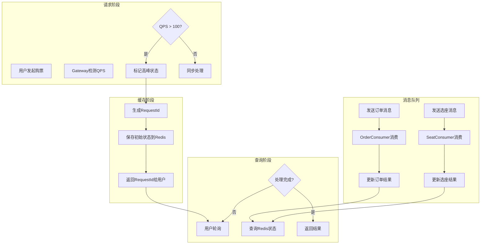

**图5-8 异步购票处理流程图**

### 5.5.3 消息消费者实现

```java
@MessageConsumer(
    topic = "seat-selection-topic",
    tag = "select",
    consumerGroup = "seat-selection-consumer"
)
public class SeatSelectionConsumer extends RocketMQBaseConsumer<SeatSelectionRequestMessage> {

    @Override
    protected void doProcess(SeatSelectionRequestMessage message) {
        // 1. 获取选座策略
        SeatSelectionStrategy strategy = strategyFactory.getStrategy(message.getSeatType());

        // 2. 执行座位选择
        TicketDTO result = strategy.select(message);

        // 3. 更新处理结果到Redis
        updateResultToCache(message.getRequestId(), result);

        // 4. 发送订单创建消息
        if (result != null) {
            messageQueueService.send("order-creation-topic", "create", buildOrderMessage(result));
        }
    }
}
```
