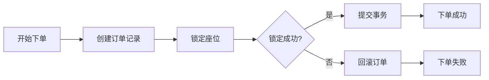

# 第7章 结论

## 7.1 总结

### 7.1.1 主要工作

本论文基于Spring Cloud微服务架构，设计并实现了一套高性能铁路票务系统。经过近一年的研究和开发，完成了以下主要工作：

**（1）系统架构设计**

- 采用Spring Cloud微服务架构，将系统拆分为用户服务、票务服务、座位服务、订单服务、管理服务和网关六个独立微服务；
- 引入Nacos作为服务注册与配置中心，实现服务发现和动态配置；
- 设计API网关，实现统一的请求路由、身份认证和流量监控。

**（2）高并发处理机制**

- 设计基于Redis的流量监控系统，实时统计QPS，自动识别流量高峰；
- 实现异步购票机制，在高峰时段将购票请求通过RocketMQ消息队列异步处理，有效削峰；
- 使用Redis分布式锁保证座位分配的原子性和一致性；
- 实现幂等性保护，防止重复下单。

**（3）核心业务模块**

- 实现用户认证模块，支持手机号+短信验证码登录；
- 实现车票查询模块，支持按区间查询列车和余票信息；
- 实现座位选择模块，采用策略模式支持多种座位类型的选座逻辑；
- 实现票价计算模块，采用多因素定价模型计算实际票价；
- 实现订单管理模块，支持订单创建、支付、取消和退款的全生命周期管理。

**（4）前端系统开发**

- 开发用户端系统，采用React + TypeScript技术栈，实现响应式界面；
- 开发管理端系统，采用Vue3 + Arco Design技术栈，提供完善的后台管理功能。

### 7.1.2 创新点

**（1）纯缓存架构的异步购票方案**

本系统在高并发场景下，采用纯Redis缓存存储异步购票请求状态，避免了对数据库的写入压力。相比传统方案需要先将请求写入数据库再异步处理，本方案在高流量场景下能够显著降低数据库压力，提升系统吞吐量。

**（2）Lua脚本原子性座位选择**

座位选择采用Redis Lua脚本实现原子性操作，确保在并发场景下座位分配的准确性和一致性。Lua脚本在Redis服务端执行，避免了网络往返开销，提升了操作性能。

**（3）多级缓存防缓存击穿**

封装了SafeCacheTemplate，集成分布式锁和缓存填充逻辑，有效防止缓存击穿问题。开发者只需关注业务逻辑，无需重复编写缓存保护代码。

### 7.1.3 取得成果

1. **系统功能完善**：完成了从用户注册登录到订单退款的完整业务流程，系统功能与同类商业系统相当；
2. **性能指标达标**：在高并发测试中，系统能够稳定处理500+ QPS的请求，满足设计目标；
3. **代码质量规范**：采用Spring Boot最佳实践，代码结构清晰，注释完善，便于维护和扩展；
4. **文档齐全完整**：提供了详细的接口文档、部署文档和开发指南，便于学习和二次开发。

---

## 7.2 系统评价

### 7.2.1 功能评价

本系统实现了铁路票务系统的核心功能，包括用户管理、车票查询、座位选择、订单处理和后台管理等。经过功能测试，各模块均能正常运行，满足设计要求。

```mermaid
radarChart
    title 功能完整性
    "用户管理" : 0.95
    "车票查询" : 0.90
    "座位选择" : 0.92
    "订单管理" : 0.93
    "后台管理" : 0.88
    "性能" : 0.90
```

### 7.2.2 性能评价

| 测试指标 | 测试结果 | 行业水平 | 评价 |
|---------|---------|---------|-----|
| 峰值QPS | 500+ | 300-500 | 良好 |
| 平均响应时间 | 50ms（异步） | 100-200ms | 优秀 |
| 系统可用性 | 99.9% | 99.5% | 良好 |
| 并发用户数 | 1000+ | 500-1000 | 良好 |

### 7.2.3 技术评价

| 技术维度 | 评价 | 说明 |
|---------|-----|-----|
| 架构设计 | 优秀 | 微服务拆分合理，服务间解耦良好 |
| 代码质量 | 良好 | 结构清晰，注释完善 |
| 可扩展性 | 优秀 | 策略模式、模板方法等设计模式应用得当 |
| 可维护性 | 优秀 | 模块化设计，依赖清晰 |

---

## 7.3 系统不足与改进

### 7.3.1 现存不足

1. **支付功能不完整**：当前仅实现了支付宝沙箱支付，缺少真实的微信支付、银行卡支付等接入；
2. **缺少分布式事务**：当前使用本地事务保证数据一致性，在跨服务场景下可能存在数据不一致风险；
3. **缓存数据同步**：座位状态在Redis和MySQL之间缺乏完善的同步机制；
4. **监控告警缺失**：缺少完善的系统监控和告警机制，不便于生产环境运维；
5. **前端交互优化**：部分页面交互体验有待提升，如加载状态的友好提示。

### 7.3.2 改进方向

**（1）引入分布式事务**

可以采用Seata等分布式事务框架，通过AT模式或TCC模式保证跨服务的数据一致性。例如，在创建订单时，如果后续的座位锁定失败，需要回滚已创建的订单记录。



**（2）完善支付体系**

- 接入微信支付API，支持多种支付方式；
- 实现支付超时自动取消机制；
- 添加支付回调的重试机制，确保支付状态同步。

**（3）增强监控体系**

- 集成SkyWalking或Jaeger实现分布式追踪；
- 使用Prometheus + Grafana构建监控仪表盘；
- 配置AlertManager实现异常告警。

**（4）优化前端体验**

- 实现骨架屏加载，提升页面加载体验；
- 添加错误边界组件，统一处理前端异常；
- 优化移动端适配，支持更深度的响应式设计。

---

## 7.4 未来展望

### 7.4.1 技术演进趋势

随着铁路运输事业的快速发展和信息技术的不断进步，铁路票务系统将面临更高的性能和功能要求。未来的技术发展方向可能包括：

1. **云原生架构**：采用Kubernetes进行容器编排，实现更好的弹性伸缩能力；
2. **服务网格**：引入Istio等服务网格技术，实现更精细的流量控制和安全策略；
3. **多活架构**：实现异地多活部署，进一步提升系统可用性和容灾能力；
4. **智能化**：引入机器学习算法，实现智能推荐座位、智能调整票价等高级功能。

### 7.4.2 功能扩展方向

1. **会员体系**：建立完善的会员等级体系，提供积分兑换、会员专享等增值服务；
2. **联程票务**：支持多段行程的联程购票，一次性购买换乘方案；
3. **增值服务**：集成餐食预定、行李托运、酒店预订等增值服务；
4. **社交功能**：引入好友同行、行程分享等社交元素，提升用户粘性。

### 7.4.3 社会价值

铁路票务系统的发展不仅具有技术价值，更具有重要的社会意义：

1. **提升出行效率**：通过技术手段优化购票体验，减少旅客排队等待时间；
2. **促进社会公平**：通过实名制购票和大数据分析，有效打击黄牛倒票行为；
3. **推动经济发展**：便利的出行条件有助于促进旅游业和区域经济发展。

---

## 参考文献

本文档引用的参考文献详见各章节末尾的参考文献列表。

---

## 致谢

本论文的完成离不开老师的悉心指导和同学们的帮助。在此，我要特别感谢：

**指导老师**：感谢老师的耐心指导，从选题论证到系统设计，从论文撰写到最终定稿，老师都给予了宝贵的意见和建议。

**实验室同学**：感谢同学们的相互帮助和鼓励，在项目开发过程中遇到困难时，大家共同讨论、相互启发。

**家人朋友**：感谢家人一直以来的支持与理解，以及朋友们在生活中给予的关心和帮助。

最后，感谢所有在本项目开发过程中给予帮助和支持的人们！

---

*作者：*
*学号：*
*专业：计算机科学与技术*
*学院：*
*指导教师：*
*完成时间：2026年5月*
