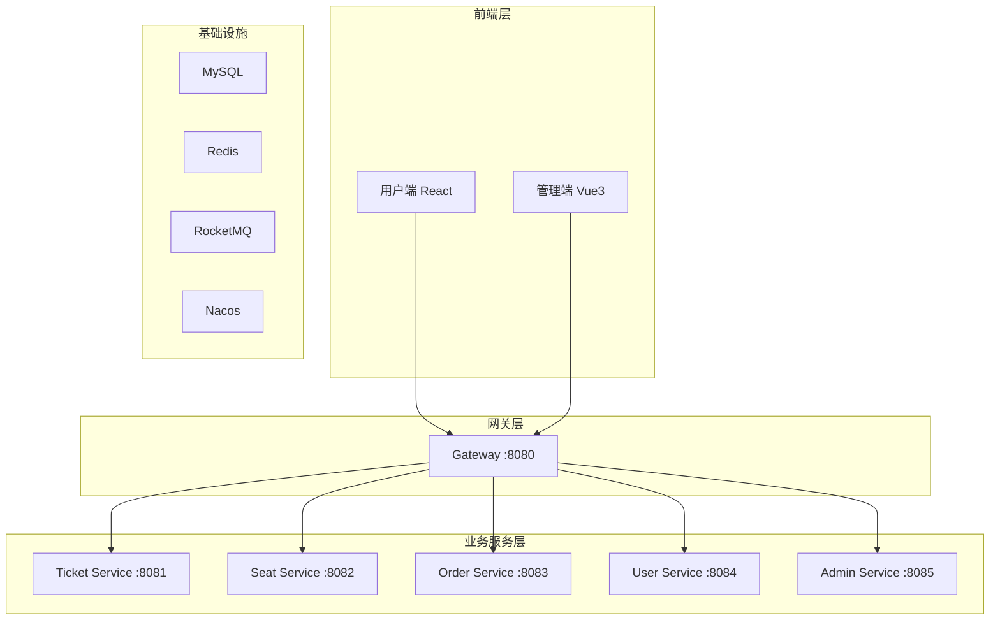
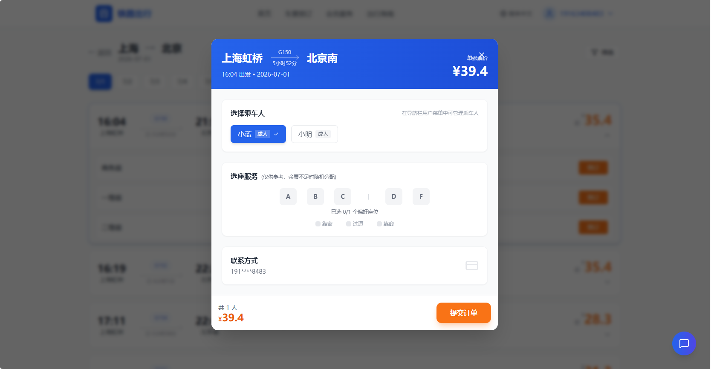
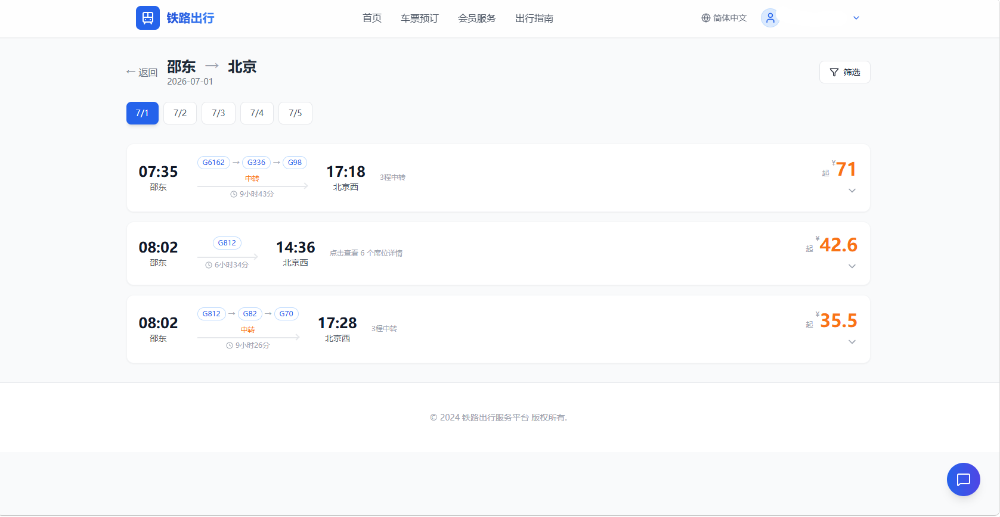
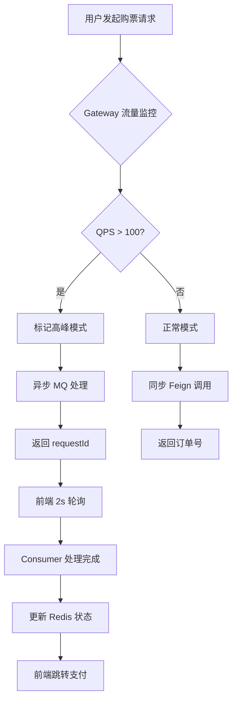
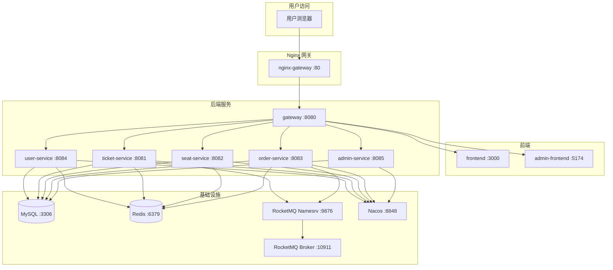
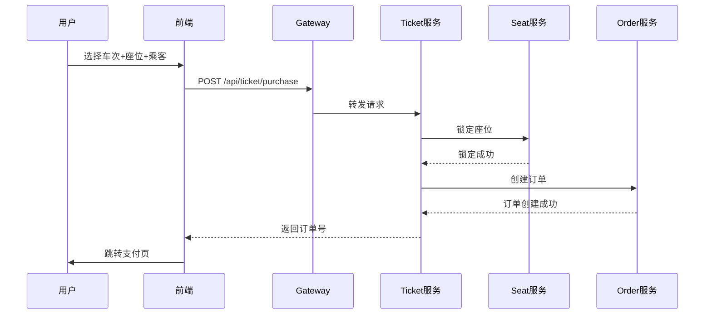
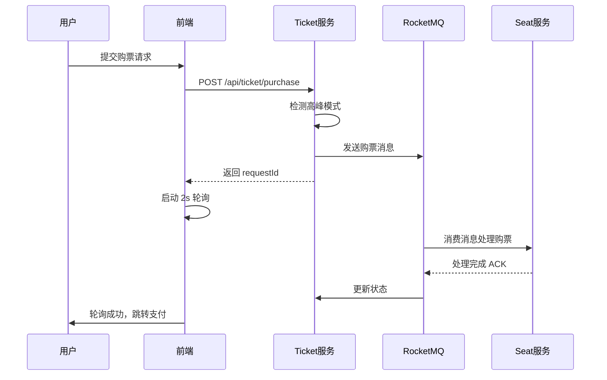

# 12306 铁路票务系统

基于 Spring Cloud + React 的高性能铁路票务系统，支持高并发购票、座位选择、订单管理等核心功能。


---

## 一、系统架构

### 1.1 整体架构图



### 1.2 核心服务说明

| 服务 | 端口 | 功能描述 |
|------|------|----------|
| Gateway | 8080 | 流量监控、JWT认证、请求追踪、路由分发 |
| Ticket | 8081 | 车票搜索、中转换乘、购票下单 |
| Seat | 8082 | 座位查询、座位锁定、选座 |
| Order | 8083 | 订单创建、支付、退款 |
| User | 8084 | 用户登录、乘车人管理 |
| Admin | 8085 | 后台数据管理、统计分析 |

### 1.3 技术栈

| 层级 | 技术 |
|------|------|
| 后端框架 | Spring Boot 3.0.7 + Spring Cloud |
| 服务调用 | OpenFeign |
| 数据库 | MySQL 8.0 + MyBatis-Plus |
| 缓存 | Redis + Redisson |
| 消息队列 | RocketMQ |
| 注册/配置中心 | Nacos |
| 前端用户端 | React 18 + TypeScript + Vite + TailwindCSS |
| 前端管理端 | Vue 3 + Arco Design + TypeScript |

---

## 二、核心功能

### 2.1 票务核心功能

#### 车票搜索
- 支持单程、往返、中转换乘搜索
- 高铁/动车/普快筛选
- 出发时间区间筛选


#### 座位选择
- 支持自动分配座位
- 支持手动选择 A/B/C/D/F 座位偏好
- 实时显示余票情况




#### 票价计算
- 多维度计价（座位类型、里程、节假日浮动）
- 学生票、儿童票优惠

#### 中转换乘
- A* 寻路算法计算最优中转方案
- 支持多程中转（2程、3程及以上）
- 显示全程票价




### 2.2 高并发处理



#### 核心策略
- **流量监控**：QPS > 100 自动标记高峰
- **异步购票**：Redis 锁 + MQ 削峰填谷
- **前端轮询**：状态实时反馈
- **幂等性保护**：分布式锁防止重复扣款

### 2.3 用户系统

#### 登录认证
- 短信验证码登录
- JWT Token 认证
- 管理员/普通用户角色区分


#### 乘车人管理
- 添加/编辑/删除乘车人
- 实名制身份信息管理
- 常旅客快速选择

#### 候补购票
- 当目标车次无票时可提交候补订单
- Redis 优先级队列排序，按 VIP 等级、订单数等因素综合评分
- 有票时自动兑现，发送短信通知用户
- 支持查看候补订单列表、取消候补、查看详情


#### 出行服务提醒
- 出发前 1 小时短信通知
- 出发前 30 分钟短信通知
- 到达时短信通知
- 晚点、停运、检票口变更等实时状态推送
- 支持查询订单提醒状态


#### 车站大屏
- 实时显示车站出发列车信息
- 列车运行状态：正点、晚点、待定
- 检票状态：未开始、进行中、已停止、已发车
- 候车室分配、站台号、检票口信息
- 公告通知（如晚点提醒）
- 建议每 30 秒自动刷新


### 2.4 后台管理

#### Dashboard 统计
- 今日订单量
- 销售额统计
- 热门线路 TOP10


#### 核心功能
- 用户管理（状态启用/禁用）
- 车次管理（增删改查、售卖状态）
- 订单管理（查看详情、退款处理）
- 车站管理

---

## 三、部署指南

### 3.1 环境要求

| 组件 | 版本要求 | 说明 |
|------|----------|------|
| JDK | 17+ | Java 运行环境 |
| Node.js | 18+ | 前端构建环境 |
| MySQL | 8.0+ | 主数据库 |
| Redis | 6.0+ | 缓存/分布式锁 |
| RocketMQ | 4.9+ | 消息队列 |
| Nacos | 2.x | 服务注册/配置中心 |

### 3.2 项目结构

```
12306/
├── Services/                    # 后��微服务
│   ├── gateway-service/        # API 网关
│   ├── ticket-service/         # 车票服务
│   ├── seat-service/           # 座位服务
│   ├── order-service/          # 订单服务
│   ├── user-service/           # 用户服务
│   └── admin-service/          # 后台管理服务
├── Frameworks/                  # 公共框架
│   ├── common/                 # 通用 DTO、枚举、常量
│   ├── cache/                  # Redis 封装
│   ├── database/               # MyBatis-Plus 配置
│   ├── Idempotent/             # 幂等性模块
│   ├── mq/                     # 消息队列封装
│   └── log/                    # 日志监控
├── 12306/                      # 前端用户端 (React)
├── admin/                      # 前端管理端 (Vue3)
├── DataScript/                 # Python 数据导入脚本
├── createTable.sql             # 数据库建表脚本
└── README.md
```

### 3.3 初始化步骤

#### 步骤 1：初始化数据库

```bash
# 创建数据库
mysql -u root -p -e "CREATE DATABASE my12306;"

# 导入表结构
mysql -u root -p my12306 < createTable.sql
```

#### 步骤 2：导入基础数据

```bash
cd DataScript
pip install -r requirements.txt

# 导入车站数据
python 1_import_stations.py

# 导入列车数据
python 2_import_trains.py

# 导入座位数据
python 3_import_seats.py

# ... 其他必要脚本
```

#### 步骤 3：启动基础设施

```bash
# 启动 MySQL
# 端口: 3306

# 启动 Redis
# 端口: 6379

# 启动 RocketMQ
# 端口: 9876 (nameserver), 10911 (broker)

# 启动 Nacos
# 端口: 8848
```

#### 步骤 4：启动后端服务

```bash
# 编译项目
mvn clean install -DskipTests

# 按顺序启动（推荐使用 IDE 或 Docker）
java -jar Services/gateway-service/target/gateway-service.jar
java -jar Services/user-service/target/user-service.jar
java -jar Services/seat-service/target/seat-service.jar
java -jar Services/ticket-service/target/ticket-service.jar
java -jar Services/order-service/target/order-service.jar
java -jar Services/admin-service/target/admin-service.jar
```

#### 步骤 5：启动前端

```bash
# 用户端
cd 12306
npm install
npm run dev      # http://localhost:5173

# 管理端
cd admin
npm install
npm run dev      # http://localhost:5174
```

#### 步骤 6：访问系统

- 用户端：http://localhost:80（或 http://localhost:3000 如果使用 Nginx）
- 管理端：http://localhost:5174
- Nacos 控制台：http://localhost:8848/nacos（用户名/密码：nacos/nacos）
- Prometheus：http://localhost:9090
- Grafana：http://localhost:3000（用户名/密码：admin/admin123）

### 3.4 Docker 部署（推荐）

项目已配置完整的 Docker 环境，支持一键启动所有服务。

#### 前置要求

- Docker 20.10+
- Docker Compose 2.0+

#### 快速启动

```bash
# 1. 克隆项目后，进入项目根目录
cd 12306

# 2. 构建并启动所有服务
docker compose up -d

# 3. 查看服务状态
docker ps

# 4. 查看日志
docker logs -f
```

#### 服务架构



#### 核心服务说明

| 容器名称 | 端口映射 | 功能描述 |
|---------|---------|----------|
| 12306-nginx-gateway | 80:80 | Nginx 网关，统一入口 |
| 12306-mysql | 3306:3306 | MySQL 8.0 数据库 |
| 12306-redis | 6379:6379 | Redis 7 缓存 |
| 12306-nacos | 8848:8848 | Nacos 服务注册/配置中心 |
| 12306-rocketmq-namesrv | 9876:9876 | RocketMQ NameServer |
| 12306-rocketmq-broker | 10911:10911 | RocketMQ Broker |
| 12306-gateway | 8080:8080 | API 网关 |
| 12306-user | 8084:8084 | 用户服务 |
| 12306-ticket | 8081:8081 | 车票服务 |
| 12306-seat | 8082:8082 | 座位服务 |
| 12306-order | 8083:8083 | 订单服务 |
| 12306-admin | 8085:8085 | 后台管理服务 |
| 12306-frontend | 3000:80 | 用户端 React |
| 12306-admin-frontend | 5174:80 | 管理端 Vue3 |
| 12306-prometheus | 9090:9090 | Prometheus 监控 |
| 12306-grafana | 3000:3000 | Grafana 可视化 |


#### 数据初始化

首次启动后，数据库和 Nacos 会自动初始化：

- MySQL：自动创建 `my12306` 数据库并导入表结构
- Nacos：自动导入配置数据
- RocketMQ：自动创建所需 Topic

#### 环境变量说明

各服务通过环境变量连接基础设施：

```yaml
environment:
  - SPRING_PROFILES_ACTIVE=docker   # 使用 Docker 配置
  - NACOS_SERVER_ADDR=nacos:8848    # Nacos 地址
  - MYSQL_HOST=mysql                # MySQL 地址
  - MYSQL_PORT=3306                 # MySQL 端口
  - REDIS_HOST=redis                # Redis 地址
  - REDIS_PORT=6379                 # Redis 端口
  - ROCKETMQ_NAMESRV=rocketmq-namesrv:9876  # RocketMQ 地址
  - JAVA_OPTS=-Xms256m -Xmx512m     # JVM 参数
```

### 3.5 服务端口一览

| 服务 | 端口 | API 路径 |
|------|------|----------|
| Gateway | 8080 | /api/** |
| Ticket | 8081 | /api/ticket/**, /api/trainDetail/** |
| Seat | 8082 | /api/seat/** |
| Order | 8083 | /api/order/** |
| User | 8084 | /api/user/** |
| Admin | 8085 | /api/admin/** |

### 3.5 默认账号

| 角色 | 用户名 | 密码 |
|------|--------|------|
| 管理员 | admin | 123456 |
| 普通用户 | 手机号 | 短信验证码登录 |

---

## 四、核心流程图

### 4.1 购票流程



### 4.2 高峰模式异步购票



---
