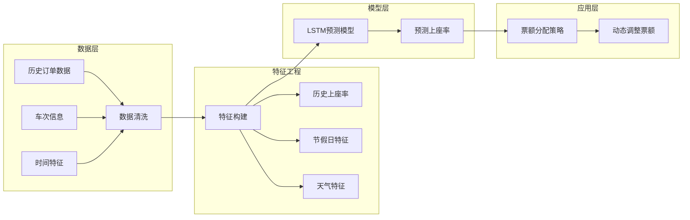

# 12306 铁路票务系统 - 开发计划

> 基于 Spring Cloud 微服务架构的高性能铁路票务系统

---

## 项目概述

本项目是一个完整的铁路票务系统，包含用户端（React）、管理端（Vue3）、后端微服务（Spring Cloud）以及数据脚本（Python）。

### 技术栈

| 层级 | 技术 |
|------|------|
| 后端 | Spring Boot 3.0.7 + Spring Cloud, MyBatis-Plus |
| 中间件 | Redis + Redisson, RocketMQ, Nacos |
| 前端 | React 18 + TypeScript, Vue 3 + Arco Design |
| 数据库 | MySQL 8.0 |

### 已有功能

- [x] 用户注册登录（手机号+验证码）
- [x] 车票查询（按区间、日期）
- [x] 座位选择（手动/自动，支持多种座位类型）
- [x] 订单管理（创建、支付、取消、退款）
- [x] 后台管理（数据统计、用户/订单/车次管理）
- [x] 高峰异步购票（Redis + RocketMQ 削峰）
- [x] 分布式锁与幂等性保护

---

## 功能开发计划

### 一、核心功能完善

| 优先级 | 功能 | 描述 | 状态 |
|--------|------|------|------|
| P0 | 电子客票 | 生成乘车二维码，支持扫码核销 | 待开发 |
| P1 | 改签功能 | 改签到其他车次，支持差价计算 | 待开发 |
| P1 | 候补购票优化 | 候补队列排序，超售时自动候补 | 待开发 |
| P2 | 中转换乘优化 | 智能换乘推荐，最优路径规划 | 待开发 |
| P2 | 会员积分体系 | 积分兑换、会员等级折扣 | 待开发 |
| P3 | 行程提醒 | 发车前短信/推送提醒 | 待开发 |

### 二、工程化完善

| 优先级 | 功能 | 描述 | 状态 |
|--------|------|------|------|
| P0 | Docker 部署 | docker-compose 一键启动 | 待开发 |
| P1 | 服务监控 | Prometheus + Grafana | 待开发 |
| P1 | 链路追踪 | SkyWalking / Jaeger | 待开发 |
| P2 | 接口限流 | Sentinel | 待开发 |
| P2 | 熔断降级 | Resilience4j | 待开发 |

---

## 亮点功能

### 亮点一：基于深度学习的票额智能分配

> 利用深度学习预测每个车次、每个区间的最优票额分配，解决春运期间票务资源分配不合理的问题

#### 1.1 问题背景

春运期间，12306面临的核心问题不是"票不够"，而是"票怎么分才合理"。热门车次在放票瞬间售罄，但部分区段实际乘坐率很低，造成资源浪费。

#### 1.2 实现思路

```
数据收集 → 数据清洗 → 特征工程 → 模型训练 → 模型部署 → 业务集成
```



#### 1.3 技术方案

**数据收集**
```
来源:
1. 历史订单数据 (t_order, t_order_item)
2. 列车经停站数据 (t_train_station)
3. 节假日日历 (法定节假日、调休)
4. 天气数据 (可选, 公开API)
```

**特征工程**
```
输入特征:
- 车次ID (one-hot)
- 日期 (day of week, 是否节假日)
- 出发区间 (起点-终点)
- 历史同期上座率
- 距离春节天数
- 出发地/目的地热度

输出:
- 预测上座率 (0.0 - 1.0)
```

**模型选择**
```
候选模型:
1. LSTM (适合时序数据)
2. XGBoost (表格数据, 快速baseline)
3. Transformer (最新方法)

推荐: 先用XGBoost做baseline, 再尝试LSTM
```

#### 1.4 实施步骤

```
Phase 1: 数据准备 (Python)
├── 清洗历史订单数据
├── 构建特征工程脚本
└── 数据集划分 (训练/验证/测试)

Phase 2: 模型训练 (Python + PyTorch/TensorFlow)
├── XGBoost baseline
├── LSTM 时序模型
└── 模型评估与对比

Phase 3: 模型部署
├── 导出模型 (ONNX/Pickle)
├── Flask/FastAPI 提供推理接口
└── ticket-service 调用预测服务

Phase 4: 业务集成
├── 根据预测结果调整余票显示
└── 可视化对比 (预测 vs 实际)
```

#### 1.5 论文写作重点

> 作为本科论文，不聚焦模型本身的创新，而是展示完整的 ML Pipeline

```
重点一: 数据收集与清洗
├── 数据来源说明
├── 数据质量问题 (缺失值、异常值)
└── 清洗方法

重点二: 特征工程
├── 特征选择依据
├── 特征重要性分析
└── 特征工程代码展示

重点三: 模型训练流程
├── 训练/验证/测试集划分
├── 超参数选择
└── 训练曲线展示

重点四: 结果分析
├── 预测效果指标 (MAE, RMSE)
├── 预测 vs 实际对比
└── 误差分析
```

#### 1.6 资源需求

| 资源 | 说明 |
|------|------|
| GPU | 可选，XGBoost不需要GPU |
| 数据量 | 历史订单数据即可 |
| 框架 | PyTorch / TensorFlow / XGBoost |

#### 1.7 文档产出

- [ ] 数据收集与清洗文档
- [ ] 特征工程说明文档
- [ ] 模型训练报告
- [ ] API接口文档
- [ ] 预测效果对比分析

---

### 亮点二：Shader 渲染 UI 美化

> 利用 WebGL/Canvas Shader 美化关键 UI 组件，提升视觉效果，展示图形学知识

#### 2.1 可应用场景

| 位置 | 效果 | 技术 | 难度 |
|------|------|------|------|
| 首页背景 | 粒子动画/流动线条 | Three.js Shader | 中 |
| 座位图 | 玻璃拟态 + 发光效果 | CSS + Canvas | 低 |
| 加载动画 | Shader 进度条 | Three.js Shader | 中 |
| 支付成功 | 粒子爆发效果 | Canvas | 低 |
| 车票卡片 | 渐变 + 扫描线 | CSS Shader | 低 |
| 地图区域 | 波纹扩散 | Canvas | 低 |

#### 2.2 技术方案

**方案 A: Three.js (推荐用于复杂效果)**
```javascript
import * as THREE from 'three';

// 流动线条背景 - Fragment Shader
const shaderMaterial = new THREE.ShaderMaterial({
    uniforms: {
        time: { value: 0 },
        color1: { value: new THREE.Color('#1a1a2e') },
        color2: { value: new THREE.Color('#16213e') },
    },
    vertexShader: `
        varying vec2 vUv;
        void main() {
            vUv = uv;
            gl_Position = projectionMatrix * modelViewMatrix * vec4(position, 1.0);
        }
    `,
    fragmentShader: `
        uniform float time;
        uniform vec3 color1;
        uniform vec3 color2;
        varying vec2 vUv;

        void main() {
            float wave = sin(vUv.x * 10.0 + time) * 0.5 + 0.5;
            vec3 color = mix(color1, color2, wave);
            gl_FragColor = vec4(color, 1.0);
        }
    `,
});
```

**方案 B: 纯 Canvas 2D Shader**
```
适用于简单效果:
- 波纹扩散
- 渐变背景
```

**方案 C: CSS 增强 (快速实现)**
```css
/* 玻璃拟态 */
.glass {
    background: rgba(255, 255, 255, 0.1);
    backdrop-filter: blur(10px);
    border: 1px solid rgba(255, 255, 255, 0.2);
}

/* 发光效果 */
.glow {
    box-shadow: 0 0 20px rgba(59, 130, 246, 0.5);
}
```

#### 2.3 具体效果建议

**高频用户触达区（重点实现）**

```
1. 首页 Hero 区域
   └── 粒子流动 + 铁路线路动画
   └── 科技感铁路主题背景

2. 座位选择弹窗
   ├── 玻璃拟态背景 (backdrop-filter)
   ├── 座位悬停发光 (CSS filter)
   └── 选中座位波纹扩散

3. 车票卡片
   ├── 金属质感渐变
   ├── 条形码扫描线效果
   └── 翻页动效

4. 支付成功页
   └── 粒子爆发庆祝动效
```

**Shader 代码示例 - 发光脉冲效果**
```glsl
// 座位选中发光效果
uniform float time;
uniform float glow; // 0.0 - 1.0

void main() {
    vec3 baseColor = vec3(0.2, 0.6, 1.0);
    float pulse = sin(time * 3.0) * 0.3 + 0.7;
    vec3 glowColor = baseColor * pulse * (1.0 + glow);
    gl_FragColor = vec4(glowColor, 1.0);
}
```

#### 2.4 实施建议

```
建议顺序:
1. 先实现 CSS 效果 (快速见效, 1-2天)
   ├── 玻璃拟态
   ├── 渐变背景
   └── CSS 动画

2. 再实现 Canvas 效果 (3-5天)
   ├── 粒子背景
   ├── 波纹扩散
   └── 座位图特效

3. 最后实现 Three.js 效果 (5-7天)
   ├── 复杂粒子动画
   └── 车票卡片 Shader
```

#### 2.5 论文展示点

```
1. Shader 原理说明
   ├── 顶点着色器 vs 片元着色器
   ├── uniforms vs varyings
   └── GLSL 语法基础

2. 效果实现过程
   ├── 需求分析
   ├── Shader 代码编写
   └── 效果调优

3. 性能考虑
   ├── 60fps 优化
   ├── 移动端适配
   └── WebGL 降级方案
```

---

## 开发优先级建议

### 短期目标（1-2周）

```
1. Docker 部署
   └── 方便答辩演示，一键启动所有服务

2. Shader UI 美化 (Phase 1)
   └── CSS 玻璃拟态 + 座位图特效
```

### 中期目标（3-4周）

```
3. 深度学习票额预测 (Phase 1-2)
   └── 数据收集 + 模型训练

4. 电子客票
   └── 完善核心业务流程
```

### 长期目标（5-6周）

```
5. 深度学习模型部署 (Phase 3-4)
   └── API 服务 + 业务集成

6. Shader UI 美化 (Phase 2-3)
   └── Three.js 复杂效果
```

---

## 文档产出清单

| 文档 | 章节归属 | 状态 |
|------|----------|------|
| 系统接口文档 | - | 待更新 |
| 部署文档 (Docker) | - | 待开发 |
| 深度学习数据清洗报告 | 3.4/5.3 | 待开发 |
| 深度学习模型训练报告 | 5.3 | 待开发 |
| Shader 效果实现文档 | 5.5 | 待开发 |

---

## 参考资料

### 深度学习
- LSTM 时序预测: https://pytorch.org/tutorials/beginner/nlp/sequence_models_tutorial.html
- XGBoost: https://xgboost.readthedocs.io/
- ONNX 模型部署: https://onnxruntime.ai/

### Shader/WebGL
- Three.js Shaders: https://threejs.org/examples/?q=shader
- The Book of Shaders: https://thebookofshaders.com/
- GLSL Functions: https://iquilezles.org/articles/functions/
